# Anatomy of an egressing request

This page traces a single outbound connection from inside a filtered
workspace — `curl https://example.com` — from the application's
`connect()` to the verdict and the learned ACCEPT/REJECT. The egress path
has **two gates** (a DNS gate and a connection-SYN gate), an async consent
loop, and **two different allow/deny models**; a diagram keeps the whole
model in one place.

For operator-facing configuration (enablement, `allowed_domains` grammar
by example, service lists) see [Egress Filtering][egress-docs]. This page
is about what happens at runtime, inside the [network sidecar][egress-issue].

[egress-docs]: ../features/egress-filtering.md
[egress-issue]: https://github.com/mcdonc/klangk/issues/2250

## The short version

1. **DNS resolution is gate 1.** All `:53` traffic is `REDIRECT`ed to the
   sidecar's FQDN proxy. A name that matches the static allow-list
   (`allowed_domains`) or an in-effect consent allow resolves normally and
   each resolved IP gets a port-scoped `ACCEPT` rule — no consent involved.
   A name on the reject-list (`rejected_domains`) gets `NXDOMAIN`
   unconditionally. An off-list name in `interactive`/`allow` mode **still
   resolves** (the workspace gets the IP), but the proxy only records the
   IP→host mapping — the connection itself is gated next. In `static` mode
   the off-list name gets `NXDOMAIN` locally — the query is never forwarded,
   so there is no resolution oracle and no DNS exfiltration
   channel.
2. **The connection SYN is gate 2.** The kernel `OUTPUT` chain walks its
   rules top-down: learned `ACCEPT`/`REJECT` rules (inserted at the top at
   runtime) first, then the static startup rules (loopback, established,
   the proxy's own marked DNS, CIDR specs, the klangkd gateway). Anything
   still unmatched lands in the sidecar's `NFQUEUE` consumer.
3. **The consumer checks its memories, then holds.** A per-connection
   verdict cache answers SYN retransmits; an in-session allow or deny that
   still covers the host:port answers without prompting (this is what keeps
   CDN-rotated IPs from re-prompting). Otherwise the SYN is **held** and a
   consent request travels over the sidecar WebSocket to klangkd.
4. **klangkd gates too, then asks a human.** `egress_mode: allow` and
   paused-prompting answer at once; static mode records a denial and
   answers deny; interactive mode creates a pending `egress_consent` row
   and fans out to the connected deciders (CLI TUI / browser). A hold
   times out fail-closed (`egress_consent_timeout`, default 120 s).
5. **The verdict is applied where the SYN is held.** Allow → an in-session
   host:port memory (unless `once`) plus an all-ports `ACCEPT` for the
   resolved IP, then `pkt.accept()`. Deny → an in-session deny memory, a
   forged RST so `connect()` fails with `ECONNREFUSED` immediately, and a
   temporary `REJECT` rule. `forever` verdicts additionally mutate the
   workspace's persisted `allowed_domains` / `rejected_domains`.

## The flow

```mermaid
flowchart TD
    APP["Workspace process<br/>connect(host:port)"]
    APP -->|"1. resolver: A? host to :53"| REDIR
    subgraph K1["Kernel nat OUTPUT"]
        REDIR["all :53 REDIRECT to the sidecar FQDN proxy<br/>(the proxy's own marked upstream forwards are exempt)"]
    end

    subgraph G1["GATE 1 - sidecar FQDN DNS proxy"]
        direction TB
        RJ{"rejected_for(host)?"}
        PF{"ports_for(host)?<br/>static allowed_domains +<br/>in-session consent allows"}
        LRN["forward upstream, answer the client,<br/>install port-scoped ACCEPT rules for each<br/>resolved IP (lifetime: DNS TTL, capped at a<br/>timed allow's remaining window)"]
        REC["forward upstream, answer the client,<br/>record the IP-to-host mapping only - NO ACCEPT"]
        NXD["NXDOMAIN"]
        MODE{"KLANGKNETWORK_EGRESS_MODE<br/>+ consent wiring?"}
        RJ -->|"match - unconditional, every mode"| NXD
        RJ -->|no| PF
        PF -->|match| LRN
        PF -->|no| MODE
        MODE -->|"interactive/allow (consent wired)"| REC
        MODE -->|"static - refused locally, never forwarded<br/>or no consent wiring"| NXD
    end
    REDIR --> RJ

    subgraph K2["Kernel filter OUTPUT chain - first match wins"]
        direction TB
        W1{"1. learned ACCEPT / temporary REJECT<br/>(inserted at the top at runtime)"}
        W2{"2. startup rules: loopback, established,<br/>marked DNS upstream, CIDR specs, klangkd gateway"}
        W3{"3. NFQUEUE (rate-limited)<br/>- consent gate"}
        FALL["REJECT tcp-reset fallback,<br/>then the DROP policy"]
        W1 -->|miss| W2
        W2 -->|miss| W3
        W3 -->|miss| FALL
    end
    LRN -.->|"2. the SYN hits its ACCEPT"| OK["connected - no consent involved"]
    REC -.->|"2. no rule matches the SYN;<br/>the packet is queued"| W1

    subgraph G2["GATE 2 - sidecar NFQUEUE consumer"]
        direction TB
        WSD{"consent WebSocket up?"}
        VC{"verdict cache has<br/>this connection tuple?"}
        INF{"same connection<br/>already held?"}
        SA{"in-session allow still<br/>covers host:port?"}
        SD{"in-session deny still<br/>covers host:port?"}
        FASTRST["fail-fast deny: forged RST + short REJECT,<br/>connect() gets ECONNREFUSED at once"]
        ACC2["pkt.accept"]
        RSTC["RST + pkt.drop"]
        DRP["pkt.drop - the existing hold resolves it"]
        AA["learn a port-scoped ACCEPT for the allow's<br/>remaining window, pkt.accept, cache the verdict"]
        AD["forged RST + REJECT for the deny's remaining<br/>window, pkt.drop, cache the verdict"]
        HOLD["retain the packet, start a verdict task:<br/>request(host, port) over the sidecar WebSocket"]
        WSD -->|"down (fail-close)"| FASTRST
        WSD -->|up| VC
        VC -->|"allow - a SYN retransmit"| ACC2
        VC -->|"deny - a SYN retransmit"| RSTC
        VC -->|miss| INF
        INF -->|yes| DRP
        INF -->|no| SA
        SA -->|"yes - covers CDN-rotated IPs too"| AA
        SA -->|no| SD
        SD -->|yes| AD
        SD -->|no| HOLD
    end
    W3 --> WSD

    subgraph KD["klangkd ConsentCoordinator.hold"]
        direction TB
        HM{"egress_mode is allow?"}
        HP{"prompting paused?"}
        HI{"workspace interactive AND<br/>a decider is connected?"}
        HR{"under the per-workspace<br/>rate limit, not a duplicate?"}
        ALW["record the destination,<br/>answer allow at once"]
        STA["record a static denial row,<br/>answer deny at once"]
        PND["create a pending egress_consent row,<br/>arm the hold timeout<br/>(egress_consent_timeout, default 120 s)"]
        HM -->|yes| ALW
        HM -->|no| HP
        HP -->|"yes - auto-allow<br/>(a recorded deny still blocks)"| ALW
        HP -->|no| HI
        HI -->|no| STA
        HI -->|yes| HR
        HR -->|no| STA
        HR -->|yes| PND
    end
    HOLD ==>|"3. egress frame"| HM

    DEC["Deciders - CLI TUI consent screen / browser<br/>(first decision wins)"]
    PND --> DEC

    subgraph V["Verdict - sidecar applies it to the held SYN"]
        direction TB
        VA["ALLOW<br/>unless once: remember host:port in the in-session<br/>allow list, install an all-ports ACCEPT for the IP<br/>for the duration. pkt.accept, cache the verdict.<br/>forever: klangkd also appends host:port to the<br/>persisted allowed_domains"]
        VD["DENY (verdict, timeout, or lost WS - fail-close)<br/>unless once: remember host:port in the in-session<br/>deny list. Forge an RST so connect() fails at once,<br/>install a REJECT (once: this connection only, ~10 s;<br/>timed/forever: the destination, for the duration).<br/>pkt.drop, cache the verdict. forever: klangkd also<br/>appends to the persisted rejected_domains"]
    end
    DEC ==>|"allow + duration<br/>(once / 5s / 5m / 15m / 1h / 1d / 1w / tilrestart / forever)"| VA
    DEC ==>|deny| VD
    PND -.->|"hold timeout expires"| VD
    VA ==>|"4. the held SYN is released"| OK
    VD ==>|RST| ECO["connect() fails: ECONNREFUSED"]
```

Two details the diagram compresses:

- Every DNS query and every queued SYN also bumps klangkd's idle-activity
  timer for the workspace, so an egress-only workload is not reaped.
- A `once` verdict is **per connection**: the verdict cache is keyed by
  the full connection tuple (source port included), so a _new_ connection
  to the same host:port is a cache miss and prompts again. SYN
  _retransmits_ of the decided connection reuse the cached verdict.

## The matching model (one grammar, both gates)

Both gates — `ports_for` / `rejected_for` at DNS, the in-session
allow/deny lookups at the SYN — share one host matcher with nginx-style
scopes:

| Spec form       | Scope                         | `example.com` spec matches       | …and not             |
| --------------- | ----------------------------- | -------------------------------- | -------------------- |
| `example.com`   | exact (apex only)             | `example.com`                    | `api.example.com`    |
| `.example.com`  | inclusive (apex + subdomains) | `example.com`, `api.example.com` | `evilexample.com`    |
| `*.example.com` | subdomains only               | `api.example.com`                | `example.com` itself |

The suffix check requires a label boundary, so `evilexample.com` never
matches `example.com` under any form.

In-session entries a verdict installs are always **exact** — the decider
approved or denied the specific `host:port` shown, not its subdomains. A
bare-host spec in `allowed_domains` is likewise apex-only; use the
leading-dot form to cover subdomains.

## Allow model vs deny model

The two sides of a verdict are deliberately asymmetric:

|                   | Allow                                                                                                                       | Deny                                                                                        |
| ----------------- | --------------------------------------------------------------------------------------------------------------------------- | ------------------------------------------------------------------------------------------- |
| Fast path         | learned `ACCEPT` rule (per-IP) + hostname memory                                                                            | forged RST (immediate `ECONNREFUSED`) + temporary `REJECT` rule (per-IP)                    |
| Memory scope      | hostname:port in the in-session allow list; future DNS lookups of the host allow-learn automatically                        | hostname:port in the in-session deny list — covers CDN-rotated IPs the per-IP REJECT misses |
| Lifetime          | the verdict's duration (`once` learns nothing)                                                                              | the verdict's duration (`once` rejects only that connection)                                |
| Across restarts   | `forever` → appended to `allowed_domains` (persisted, re-read at sidecar start)                                             | `forever` → appended to `rejected_domains` (persisted)                                      |
| Static complement | a name off the allow-list is denied at gate 1 (`static` NXDOMAINs it; `interactive`/`allow` resolve it and deny at the SYN) | a name on the reject-list never resolves (`NXDOMAIN`)                                       |

An allow is hostname-shaped and forward-looking (the next DNS query
re-learns fresh IPs); a deny is IP-shaped at the kernel (REJECT on the
resolved IP, TTL-bounded) but hostname-shaped in the consumer's memory,
so neither side leaks on DNS rotation.

## Persistence boundaries

| State                                                            | Lives in         | Survives a sidecar restart? |
| ---------------------------------------------------------------- | ---------------- | --------------------------- |
| In-session allow/deny lists, verdict cache, in-flight set        | sidecar memory   | no — fresh session          |
| Learned `ACCEPT` / temporary `REJECT` rules                      | netns iptables   | no — re-learned on demand   |
| `egress_consent` audit rows (pending/allowed/denied/expired)     | klangkd database | yes                         |
| `allowed_domains` / `rejected_domains` (incl. `forever` appends) | klangkd database | yes — re-read at start      |

## Revocation and failure behavior

- **Revoking** a recorded verdict (decider UI) marks the row revoked and
  sends a `drop_rule` frame to the sidecar, which clears the host's
  in-session memory, kernel rules, and cached verdicts, then acks. A
  revoked `forever` allow also removes the appended `allowed_domains`
  entry.
- **Everything fails closed.** A lost consent WebSocket, a missing
  decider, a hold timeout, or a klangkd restart each resolve held or
  future SYNs to a deny (forged RST — a clean `ECONNREFUSED`, never a
  ~127 s kernel retransmit hang). On-list egress is unaffected: learned
  `ACCEPT` rules sit above the NFQUEUE gate.
