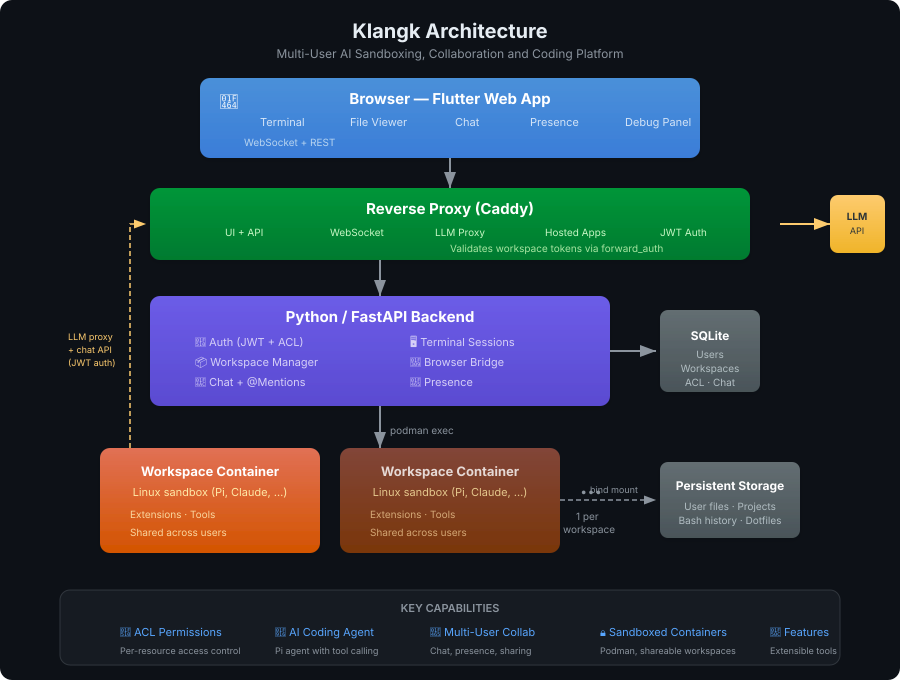

# Architecture Overview

[](../assets/architecture-overview.svg)

```text
Browser (Flutter Web + Terminal + Files)
    ├── WebSocket (authenticated): terminal I/O, exec, browser bridge, lifecycle events
    ├── Browser delegate: handles bridge requests from Pi extensions (fetch, feature actions)
    ├── Auto-reconnect with exponential backoff on disconnect
reverse proxy (Caddy; browser port 8997 = UI + API + hosted app proxy; egress port 8995 = container→host endpoints)
    ↕ LLM proxy: container → host.containers.internal:8995/llm-proxy/ → klangkd (litellm.Router)
    ↕ auth_request: validates per-workspace JWT on container→host endpoints
    ↕
Python/FastAPI backend (UDS, serves API + frontend static files)
    ├── Auth (JWT sessions, SQLite user store)
    ├── Workspace registry (user → [workspace] → container)
    ├── Browser bridge (/api/v1/browser-delegate → WebSocket → Flutter)
    ├── Terminal/exec session management
    ↕ podman exec subprocess
Pi container per workspace (interactive terminal mode)
    ├── Pi extensions (from features/*/extension.ts in the repo, baked into the workspace image)
    ├── AGENTS.md (dynamically generated on container start)
    ├── /tmp/klangk/workspace-token (per-workspace JWT, auto-renewed)
    ↕ bind mount
$KLANGKD_DATA_DIR/workspaces/<user-id>/home/<workspace-id>/
```

## Components

- **Package** (`src/klangk/`): one Python distribution shipping two top-level packages — the `klangkd` server (FastAPI, single-port: API, WebSocket, frontend static files) and the `klangk` client (`klangk` command, typer-based, talks to the server over HTTP + WebSocket for terminal access to containers). One `pip install klangk` yields both binaries.
- **Frontend** (`src/frontend/`): Flutter Web — file viewer, debug panel
- **Containers** (`src/containers/`): Custom Dockerfile for Pi agent containers with Python3, Node.js, build-essential, SQLite, vim, emacs, network tools, Pi extensions (built and run via podman)

## Data

- All data stored in `$KLANGKD_DATA_DIR` (defaults to `$DEVENV_STATE/klangk/data`)
- SQLite database: `klangk.db` (users, workspaces, groups, ACL entries, port allocations, token blocklist, login attempts, invitations)
- Workspace home volume: `workspaces/<user-id>/home/<workspace-id>/` (mounted as `/home` — the shared home `klangk/` under the default shared layout, per-member `.users/<user-id>/` + `/home/<handle>` symlinks under per-handle)
- Database persists across restarts and rebuilds
