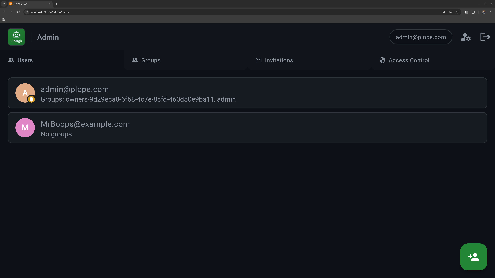
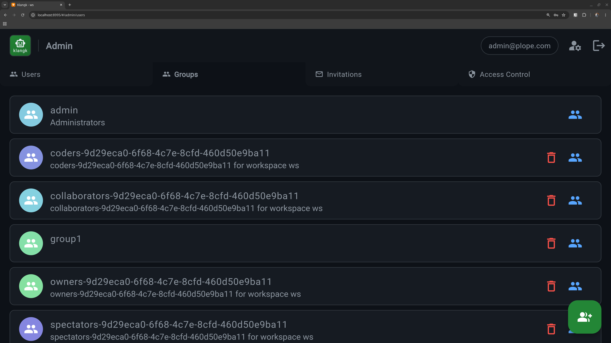

# Admin Management

- List/add/edit/delete users, create/manage groups and membership, edit ACLs on any resource
- User data archived to tar.xz on deletion, self-deletion prevented
- Admin create-user endpoint (`POST /admin/users`) creates verified users directly without email verification
