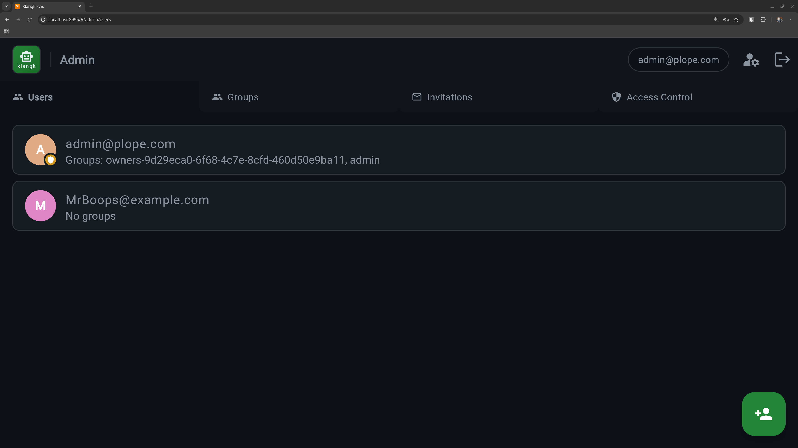
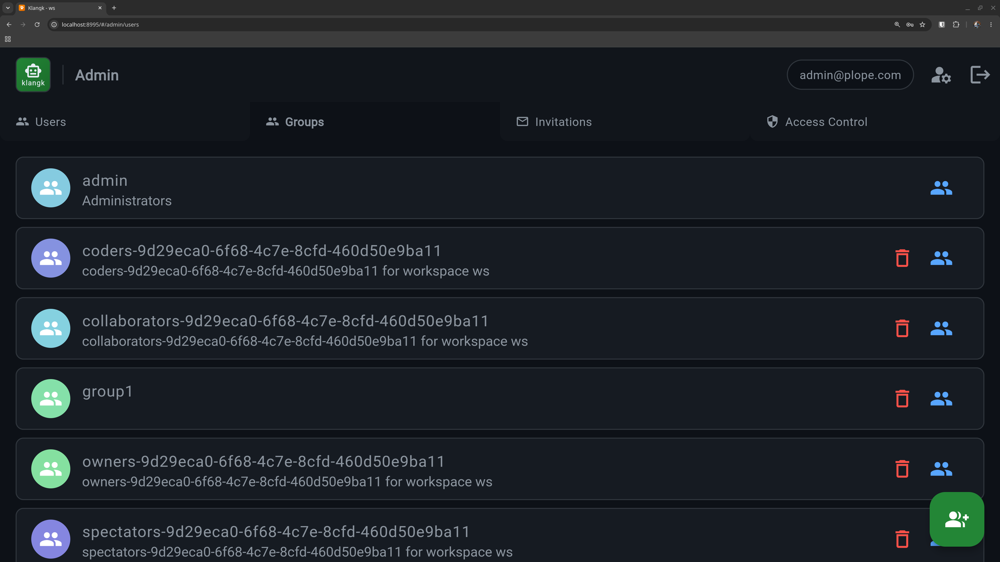

# Admin Management

Members of the `admin` group have access to the Admin page, which
provides user and group management, invitation handling, and server
scheduling for the entire Klangk instance.

## Users

The Users tab lists all registered accounts. From here you can:

- **Create users** — add a new user with an email and password.
  Admin-created users are verified immediately (no email confirmation
  needed).
- **Edit users** — change a user's email, password, or handle.
- **Delete users** — remove a user and all their data. Each workspace
  is archived to a `.tar.gz` (the export/import format, re-importable
  via `klangk import`) before its data directory is removed. You cannot
  delete your own account.

## Groups

The Groups tab lets you organize users into named groups. Groups are
used for sharing workspaces and controlling access via
[ACL rules](authorization.md).

- **Create groups** — give the group a name and optional description.
- **Manage members** — add or remove users from a group.
- **Delete groups** — removing a group also removes any ACL entries
  that reference it.

The `admin` group is created automatically on first startup and
grants access to this Admin page. The default user is added to it
automatically.

## Server

The Server tab schedules planned maintenance for the `klangkd` process
(see [Server Scheduling](server-scheduling.md) for what stop and
recycle actually do):

- **Schedule an action** — pick **Stop** or **Recycle** and either an
  absolute time (date and time pickers, your local time) or a delay
  (`2h`, `90m`, `45s`, `2h 30m`; a bare number means minutes). The
  form shows when the action will fire.
- **Pending list** — schedules soonest-first with the same live
  countdown every connected client sees; the list follows the live
  server snapshot, so changes made elsewhere appear immediately.
- **Cancel a schedule** — each row has a cancel button with a confirm
  step; cancelling clears the countdown clients see.
