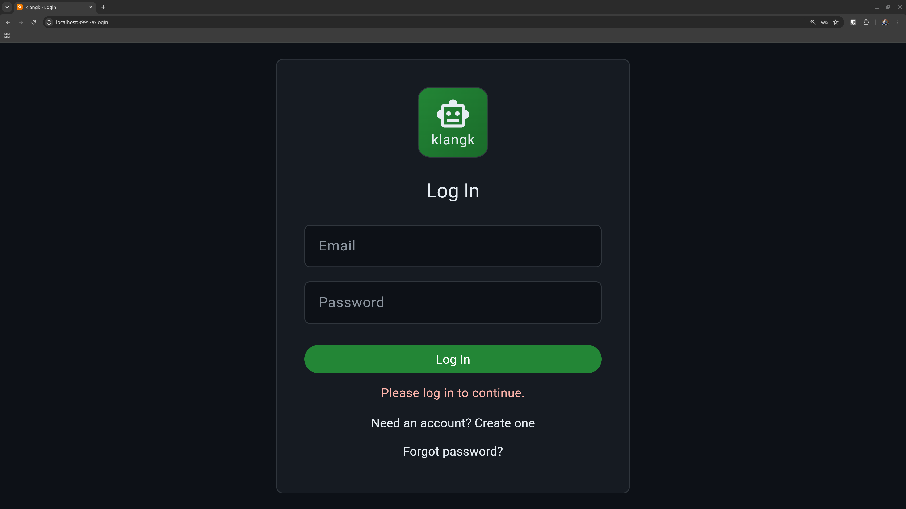

# Authentication

Klangk supports two ways to log in: email/password accounts and
single sign-on (SSO) via OIDC providers like Keycloak, Okta, or
Azure AD. You can use either or both.

## Email and password

The default setup uses email/password accounts. New users register
with an email address, receive a verification link, and set a
password. Passwords are hashed with bcrypt.

### Registration

By default, anyone can register. Set `KLANGK_DISABLE_REGISTRATION`
to block new signups and hide the registration link.

After registering, users must verify their email before they can log
in. The verification email contains a signed link that activates the
account and logs the user in automatically.

If the email doesn't arrive, click **Resend verification email** on
the login page (rate-limited to once per minute).

### Password reset

Click **Forgot password?** on the login page. A reset link is sent to
the email address (the response is always "sent" regardless of whether
the account exists, to prevent email enumeration). The link expires
after 1 hour.

### Email delivery

Verification and password-reset emails are sent via SMTP if configured
(`KLANGK_SMTP_HOST`, `KLANGK_SMTP_PORT`, etc.), or via the local
`sendmail` binary otherwise. See
[Environment Variables](../reference/environment.md) for the full list
of SMTP settings.

## Single sign-on (OIDC)

Klangk can authenticate users through one or more OIDC identity
providers. When configured, the login page shows a button for each
provider alongside the email/password form (or instead of it, if
`KLANGK_AUTH_MODES` is set to `oidc`).

Users are created automatically on their first SSO login — no
separate registration step. If a user already has an email/password
account with the same address, it is linked to their SSO identity.

The CLI (`klangkc login`) supports OIDC too: it opens a browser for
the SSO flow and receives the token via a temporary localhost callback.

See [OIDC Configuration](../reference/oidc.md) for setup instructions.

## Sessions

Klangk uses JWT tokens for sessions. Tokens expire after 24 hours
(configurable via `KLANGK_JWT_SECRET`), after which you must log in
again. Logging out blocklists the token immediately.

Your session survives page refreshes. If you navigate to a workspace
URL while logged out, you'll be redirected to the login page and
returned to your original URL after logging in.

## Brute-force protection

Optionally, Klangk can lock accounts after repeated failed login
attempts. This is disabled by default. To enable it, set:

| Variable                        | Default | Description                              |
| ------------------------------- | ------- | ---------------------------------------- |
| `KLANGK_LOGIN_LOCKOUT_FAILURES` | `0`     | Failed attempts before lockout (0 = off) |
| `KLANGK_LOGIN_LOCKOUT_WINDOW`   | `300`   | Time window in seconds for counting      |
| `KLANGK_LOGIN_LOCKOUT_DURATION` | `900`   | How long the lockout lasts (seconds)     |

## Consent banner

If `KLANGK_LOGIN_BANNER` is set, users see a consent page before
the login form. They must accept before proceeding. This is useful
for legal notices or terms-of-service acknowledgements. See
[Environment Variables](../reference/environment.md) for details.
