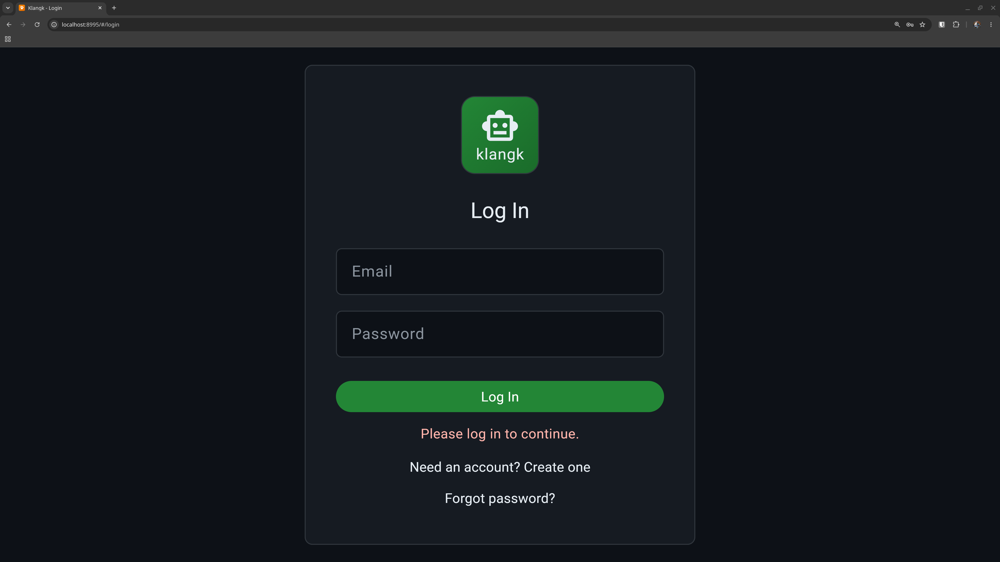

# Authentication

[](../assets/admin/login.png)

Klangk supports two ways to log in: email/password accounts and
single sign-on (SSO) via OIDC providers like Keycloak, Okta, or
Azure AD. You can use either or both. There is also a no-login
**local-dev** mode (`KLANGKD_AUTH_MODES=none`) that auto-logs you in
as the seeded default user with no password — see
[Auth Modes](auth-modes.md).

## Email and password

With `KLANGKD_AUTH_MODES` set to `password` (or `both`), klangk uses
email/password accounts. New users register with an email address, receive
a verification link, and set a password. Passwords are hashed with
PBKDF2-HMAC-SHA512 (600,000 iterations) via Python's `hashlib`, so hashing
routes through the OpenSSL the container provides — FIPS-approvable when
the FIPS provider is active ([FIPS](../deployment/fips.md)).

### Registration

By default, anyone can register. Set `KLANGKD_DISABLE_REGISTRATION`
to block new signups and hide the registration link.

After registering, users must verify their email before they can log
in. The verification email contains a signed link that activates the
account and logs the user in automatically.

If the email doesn't arrive, click **Resend verification email** on
the login page (rate-limited to once per minute).

### Password reset

Click **Forgot password?** on the login page. A reset link is sent to
the email address (the response is always "sent" regardless of whether
the account exists, to prevent email enumeration). The link expires
after 1 hour.

### Email delivery

Verification and password-reset emails are sent via SMTP if configured
(`KLANGKD_SMTP_HOST`, `KLANGKD_SMTP_PORT`, etc.), or via the local
`sendmail` binary otherwise. See
[Environment Variables](../reference/environment.md) for the full list
of SMTP settings.

## Single sign-on (OIDC)

Klangk can authenticate users through one or more OIDC identity
providers. When configured, the login page shows a button for each
provider alongside the email/password form (or instead of it, if
`KLANGKD_AUTH_MODES` is set to `oidc`).

Users are created automatically on their first SSO login — no
separate registration step. If a user already has an email/password
account with the same address, it is linked to their SSO identity.

The CLI (`klangk login`) supports OIDC too: it opens a browser for
the SSO flow and receives the token via a temporary localhost callback.

See [OIDC Configuration](../reference/oidc.md) for setup instructions.

## Account self-service

Logged-in users can change their own **password**, **handle**, and
**email** without an admin. All three are available from:

- the web UI **Settings** page, and
- the CLI `klangk account` group (`show`, `passwd`, `handle`, `email`).

Handle and email changes require your current password to confirm; a
password change requires your current password. Validation is enforced the
same way on every surface (and again, authoritatively, on the server):

- **handle** — lowercase, `[a-z0-9._-]+`, at most 32 characters. Changing
  it affects how others see you — and, on per-handle-home workspaces,
  your terminal home directory (`/home/<handle>`, see
  [Handles](handles.md)) — so the CLI confirms before applying it.
- **email** — must be a well-formed address. The account is marked
  unverified and a verification email is sent to the new address; verify it
  to fully activate the change. The address must not already be in use.
- **password** — must meet the server's minimum length
  (`KLANGKD_MIN_PASSWORD_LENGTH`, default 8).

Because the session JWT's subject is your user id (not your email), an
email change does **not** invalidate your current session — the CLI simply
re-files its cached token under the new address.

> Accounts with no password (OIDC-only users, whose credentials are
> managed by their identity provider) cannot use these routes — change
> your password, handle, and email through your IdP instead.

## Sessions

Klangk uses JWT tokens for sessions. Token lifetime defaults to 24
hours (configurable via `KLANGKD_ACCESS_TOKEN_HOURS`). Tokens are
automatically refreshed before they expire, so long-running sessions
stay active without requiring re-login. Logging out blocklists the
token immediately.

Your session survives page refreshes. If you navigate to a workspace
URL while logged out, you'll be redirected to the login page and
returned to your original URL after logging in.

## Brute-force protection

By default, Klangk locks accounts after repeated failed login
attempts (5 failures within the counting window). The same lockout
covers the credential check on `POST /auth/resend-verification` —
failed password guesses there count against the account's login
counter, and a locked-out account cannot use it either. Failed
credential checks cost the same whether or not the account exists,
so response timing cannot be used to enumerate accounts. To tune or
disable the lockout, set:

| Variable                         | Default | Description                              |
| -------------------------------- | ------- | ---------------------------------------- |
| `KLANGKD_LOGIN_LOCKOUT_FAILURES` | `5`     | Failed attempts before lockout (0 = off) |
| `KLANGKD_LOGIN_LOCKOUT_WINDOW`   | `300`   | Time window in seconds for counting      |
| `KLANGKD_LOGIN_LOCKOUT_DURATION` | `900`   | How long the lockout lasts (seconds)     |

## Concurrent session limits

Set `KLANGKD_MAX_SESSIONS_PER_USER` to cap how many concurrent
login sessions a user may have (default `0` = no limit). Each login
(password, OIDC, verification, password-reset auto-login, invite
acceptance) counts as one session; refreshing a token keeps the same
slot. When a new login pushes the user past the cap, the **oldest**
session is revoked via the token blocklist — its next HTTP request
gets `401 Token has been revoked` and its next WebSocket connect is
rejected with code `4001`, logging that client out. Sessions whose
token has already
expired are purged lazily and never count toward the cap.

## Concurrent-logon auditing

Every session records the workstation it was established from: the
effective client IP (behind a trusted reverse proxy this is the real
client from `X-Real-IP`/`X-Forwarded-For`; a direct caller cannot
spoof it) and the `User-Agent` string. When a login is concurrent
with an active session from a **different** workstation, klangkd
writes an audit record to the server log:

```text
audit: concurrent logon from different workstations: user=<id> email=<email> new session from 198.51.100.9; concurrent with session(s) from 203.0.113.7
```

This is the signal to review when credentials may be shared with (or
stolen by) a second machine — especially useful when no session cap
is configured. Sessions with an unknown IP (created before the
feature, or from clients whose address cannot be resolved) are never
reported as different, and a user logging in twice from the same
machine is not audited.

Admins can query a user's active sessions at any time — see
[`GET /api/v1/users/{id}/sessions`](../reference/api-endpoints.md#get-apiv1usersidsessions)
in the API reference. Each row shows when the session was established,
when it expires, when it was last seen active, and the workstation it
came from.

Behind a reverse proxy, the workstation audit works only when the proxy
chain forwards the real client IP (`X-Real-IP` / `X-Forwarded-For` plus
`KLANGKD_TRUSTED_PROXY_CIDRS`). If that is misconfigured, every session
records the proxy's address and no audit records are ever written — see
[Behind a Reverse Proxy: concurrent-logon auditing](../deployment/behind-a-proxy.md#concurrent-logon-auditing-depends-on-the-proxy-chain)
for how to verify the setup.

## Session workstation binding (replay protection)

Session JWTs are bearer tokens: by default (`off`), anyone who captures
one can use it until it expires. Set `KLANGKD_SESSION_BINDING` to bind
each session to the workstation it was established from, so a captured
token **cannot be replayed from another machine**:

| Mode     | Behavior                                                                 |
| -------- | ------------------------------------------------------------------------ |
| `off`    | No binding (the default) — any token holder may use it until expiry.     |
| `ip`     | Requests must come from the same network as the session's establishment. |
| `strict` | Like `ip`, and the `User-Agent` must also match.                         |

Every authenticated HTTP request, token refresh, and WebSocket connect
is checked against the session's recorded workstation (the effective
client IP, proxy-trust-aware; two IPv6 addresses inside one /64 count
as the same network, so address rotation does not kill roaming
clients). A mismatch means the token left the machine it was issued
to: the request is rejected (`401` / WebSocket close `4001`), the
session is revoked, and an audit record names both workstations:

```text
audit: session binding violation: jti=<id> issued to ip=198.51.100.7 ua=klangk-cli/1.0, presented from ip=203.0.113.9 ua=klangk-cli/1.0; session revoked
```

The legitimate client shares the token with the thief, so it is logged
out too and must re-authenticate — that is the point: a replayed token
dies the moment it is used from elsewhere. Sessions with an unknown
recorded IP (rows created before the workstation feature, or clients
whose address cannot be resolved) are never rejected. The setting is
reloadable on SIGHUP; arming it applies to existing sessions
immediately.

Trade-offs to weigh before arming `ip`/`strict`: a user whose network
address legitimately changes mid-session (laptop moving between Wi-Fi
and tethering, VPN toggles) is logged out and must log in again; in
`strict` mode a browser update changes the `User-Agent` with the same
effect. Users behind the same NAT as an attacker are not distinguished
by `ip` mode — binding narrows the replay window to the same network,
it does not eliminate same-NAT replay. Binding judges only what the
workstation resolver can see: if a deployment resolves no client IPs
at all (e.g. `KLANGKD_REJECT_PROXY_HEADERS` set while every client
arrives as an unresolvable peer), every presentation reads as unknown
and binding never rejects — verify the proxy chain forwards the real
client IP (see
[concurrent-logon auditing](#concurrent-logon-auditing)) when arming
binding.

## Idle session timeout

Tokens expire by **age**, but clients refresh them proactively, so age
alone never logs out a session nobody is using. Set
`KLANGKD_SESSION_IDLE_TIMEOUT_MINUTES` (default `0` = off) to terminate
sessions after **inactivity** instead:

- **Activity** is an authenticated HTTP request or an inbound WebSocket
  frame — including the web client's 60-second heartbeat, so a browser
  the user is actually watching stays logged in. A token refresh is
  deliberately **not** activity (it is the enforcement seam), so a
  client that only refreshes cannot idle past the window.
- When the window is armed, **token refreshes are refused** for sessions
  idle past it (`401 Session timed out due to inactivity`, token
  blocklisted), and a quiet WebSocket is **closed by the server** with
  code `4001` (client logout).
- Access-token lifetimes are **capped at the window**, so an idle
  client surfaces at its next refresh within the window plus one
  refresh interval instead of coasting on a long-lived token.
- `admins`-group members get the shorter **privileged window** — the
  lesser of this setting and
  `KLANGKD_PRIVILEGED_SESSION_IDLE_TIMEOUT_MINUTES` (default `10`;
  `0` turns the split off, giving admins the general window).

The window is read live at issue/refresh/sweep time, so a SIGHUP reload
applies immediately. Arming it on an existing deployment judges sessions
created before the feature by their issuance time (the session's
`last_seen_at` is backfilled from `created_at`) — idle ones terminate on
their next refresh; active ones get stamped by their next request. Note
the transition cost: tokens minted while unarmed are **not** recapped, so
a pre-arm session only surfaces at its next refresh — up to its residual
`KLANGKD_ACCESS_TOKEN_HOURS` lifetime away. To cut that window short,
force a re-login (revoke sessions via the admin UI) when arming, or wait
out one full token lifetime after arming.

## Dormant-account auto-disable

Accounts that go unused for too long are disabled automatically. Set
`KLANGKD_INACTIVITY_DISABLE_DAYS` (default `35`; `0` disables the
sweep) to change the window. An account counts as active when it makes
any authenticated API request — klangkd stamps a per-user
`last_activity_at` (throttled to one write per minute) on the token
auth path, so a client that stays logged in via token refresh stays
counted even though it never logs in again. Logins and (for
never-used accounts) the creation date are also counted as activity —
the sweep judges on the **newest** of the three.

The sweep runs at startup and hourly. When it disables an account,
login (password, OIDC, and no-auth local), token refresh, and every
authenticated API request fail with `403 Account disabled`; the
WebSocket rejects new connects for that user. Disabling an account
also **closes its live WebSocket connections** (close code `4001`,
which logs the client out) — admin disable and the inactivity sweep
both do this. A disabled account is also sent no password-reset
email (the reset endpoint refuses it anyway; the forgot-password
response stays `"sent"` so the disabled state is not revealed).

Two classes of account are never auto-disabled:

- members of the `admins` group — an idle deployment must not lock out
  every operator, and
- the system agent (it does not authenticate).

A disabled account keeps all of its data; an admin re-enables it via
`PATCH /api/v1/users/{id}` with `{"disabled": false}` (admins
cannot disable their own account through the same endpoint).
`GET /api/v1/users` reports each user's `disabled`,
`last_login_at`, and `last_activity_at` fields. The setting is
reloadable on SIGHUP.

## Consent banner

If `KLANGKD_LOGIN_BANNER` is set, users see a consent page before
the login form. They must accept before proceeding. This is useful
for legal notices or terms-of-service acknowledgements. See
[Environment Variables](../reference/environment.md) for details.
