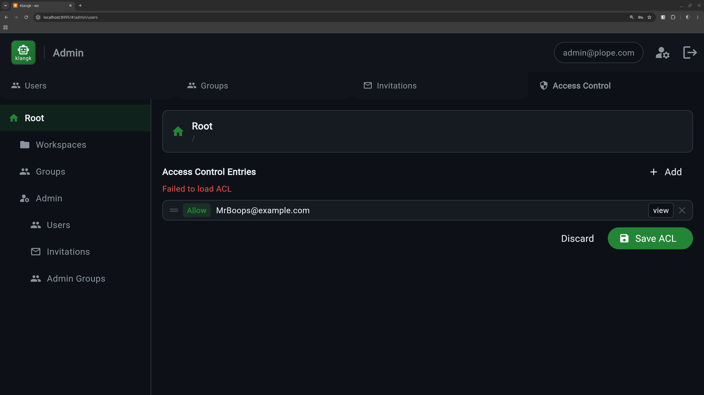

# Authorization

Klangk controls who can do what through an Access Control List (ACL)
system. Every resource — workspaces, admin pages, groups — has a list
of rules that say which users or groups are allowed or denied specific
actions.

## How it works in practice

You don't usually interact with ACLs directly. Klangk wraps them in
friendlier interfaces:

- **Workspace sharing** — the Sharing tab on each workspace lets you
  add users or groups and assign them a role (Owner, Coder,
  Collaborator, Spectator). Behind the scenes, each role maps to a
  set of ACL entries.
- **Admin panel** — the Admin page lets you manage users, groups,
  and global access rules.
- **UI visibility** — tabs and buttons appear or disappear based on
  your permissions. If you don't have `files` permission on a
  workspace, the Files tab won't show up.

For advanced use cases, the **Advanced ACL editor** in the Sharing
tab lets you view and edit the raw ACL entries directly.

## Workspace roles

When you share a workspace, you assign a role that determines what
the person can do:

| Role             | Terminal | Files | Chat | Share terminals | Type in shared | Create shared |
| ---------------- | -------- | ----- | ---- | --------------- | -------------- | ------------- |
| **Owner**        | yes      | yes   | yes  | yes             | yes            | yes           |
| **Coder**        | yes      | yes   | yes  | watch only      |                |               |
| **Collaborator** | yes      | yes   | yes  | watch + type    | yes            |               |
| **Spectator**    |          |       | yes  | watch only      |                |               |

See [Terminal - Role Permissions](terminal.md#role-permissions) for
the full permission breakdown.

## Groups

Groups are named collections of users. The built-in `admin` group is
created automatically on first startup. You can create additional
groups (e.g., "engineering", "design") and share workspaces with an
entire group instead of individual users.

Manage groups from the Admin panel under the Groups tab.

## Default access rules

On first startup, Klangk seeds these defaults:

- Any logged-in user can view pages and create workspaces
- Only members of the `admin` group can access admin functions
- Unauthenticated users are denied everything

## Learn more

For the full ACL reference — resource trees, ACE ordering, the ACL
walk algorithm, and troubleshooting — see [ACL System](../reference/acl.md).
