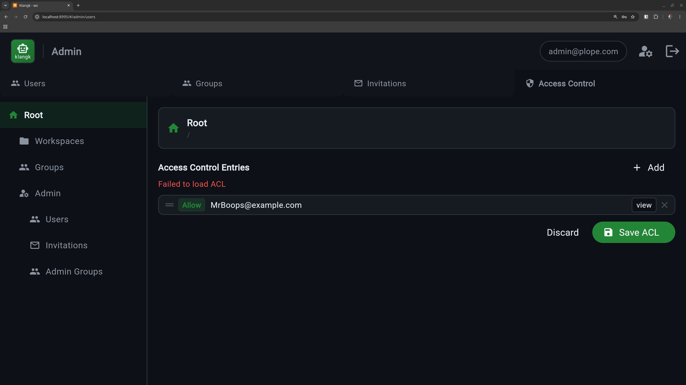

# Authorization

Klangk controls who can do what through an Access Control List (ACL)
system. Every resource — workspaces, admin pages, groups — has a list
of rules that say which users or groups are allowed or denied specific
actions.

## How it works in practice

You don't usually interact with ACLs directly. Klangk wraps them in
friendlier interfaces:

- **Workspace sharing** — the Sharing tab on each workspace lets you
  add users or groups and assign them a role (Owner, Coder,
  Collaborator, Spectator). Behind the scenes, each role maps to a
  set of ACL entries.
- **Admin panel** — the Admin page lets you manage users, groups,
  and global access rules.
- **UI visibility** — tabs and buttons appear or disappear based on
  your permissions. If you don't have `files` permission on a
  workspace, the Files tab won't show up.

For advanced use cases, the **Advanced ACL editor** in the Sharing
tab lets you view and edit the raw ACL entries directly.

## Workspace roles

When you share a workspace, you assign a role that determines what
the person can do:

| Role             | Terminal | Files | Share terminals | Type in shared | Create shared |
| ---------------- | -------- | ----- | --------------- | -------------- | ------------- |
| **Owner**        | yes      | yes   | yes             | yes            | yes           |
| **Coder**        | yes      | yes   | watch only      |                |               |
| **Collaborator** | yes      | yes   | watch + type    | yes            |               |
| **Spectator**    |          |       | watch only      |                |               |

See [Terminal - Role Permissions](terminal.md#role-permissions) for
the full permission breakdown.

## Groups

Groups are named collections of users. Two built-in groups are created
automatically on first startup:

- **admin** — the seeded admin user is added to it. Members can create
  workspaces and access admin functions.
- **members** — every new user is added automatically (registration,
  invitation acceptance, OIDC first login, admin-created). Has no
  permissions by default, but deployers can grant permissions to this
  group to apply them to all regular users.

You can create additional groups (e.g., "engineering", "design") and
share workspaces with an entire group instead of individual users.

Manage groups from the Admin panel under the Groups tab. By default,
only members of the `admin` group can create groups (the `/groups`
resource grants `create` to the admin group). To let other users create
groups, add an **Allow** entry for the `create` permission on the
`/groups` resource targeting the `members` group (or any other group)
via the ACL editor — the same recipe as [workspace creation](#granting-
workspace-creation-to-non-admin-users).

## Default access rules

On first startup, Klangk seeds these defaults:

- Any logged-in user can view pages
- Only members of the `admin` group can create workspaces, create
  groups, or access admin functions
- Unauthenticated users are denied everything

## Granting workspace creation to non-admin users

To let members (or another group) create workspaces:

1. Open the **Admin** panel and navigate to the **ACL** editor.
2. Select the `/workspaces` resource.
3. Add an **Allow** entry for the `create` permission, targeting the
   `members` group (or any other group).
4. Ensure the new entry's position is lower (checked first) than any
   Deny entry on the same resource.

The create and import buttons in the web UI will automatically appear
for users who gain the `create` permission.

## Learn more

For the full ACL reference — resource trees, ACE ordering, the ACL
walk algorithm, and troubleshooting — see [ACL System](../reference/acl.md).
