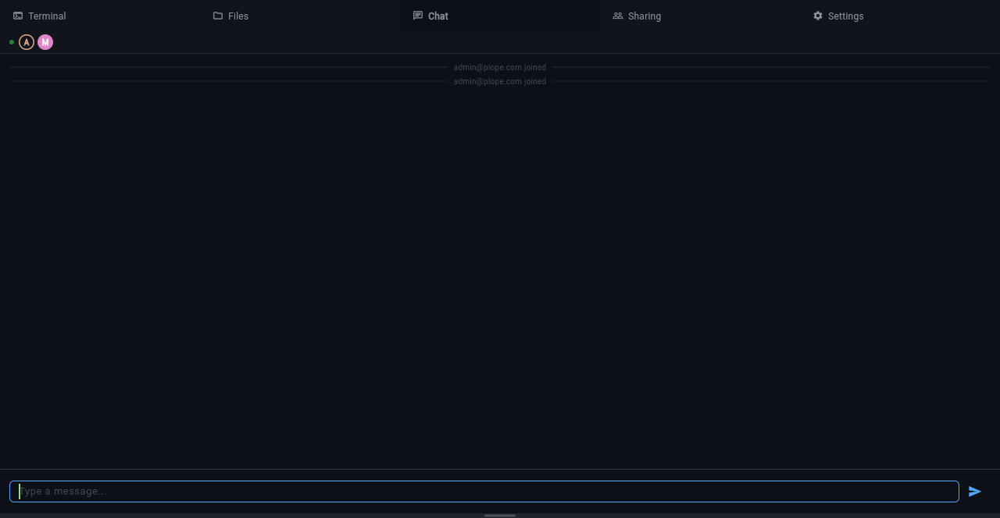
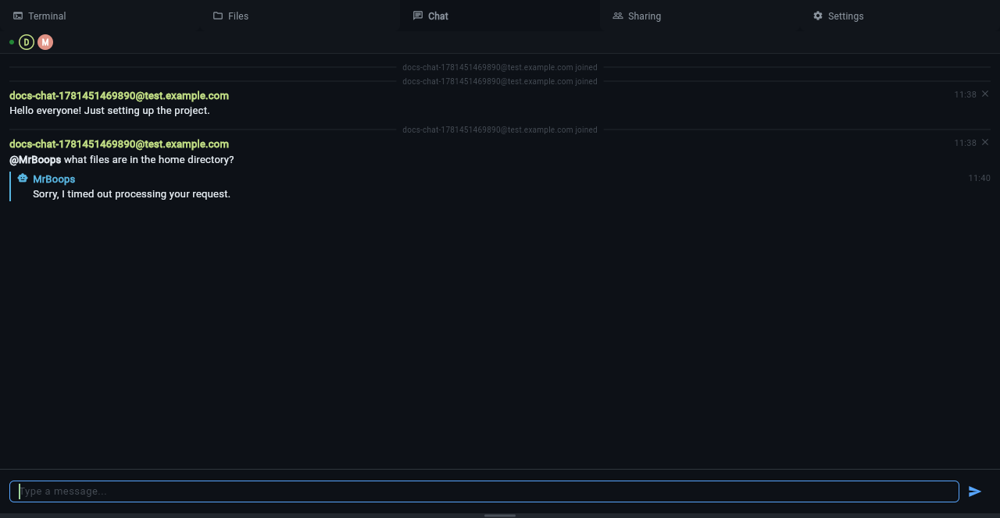
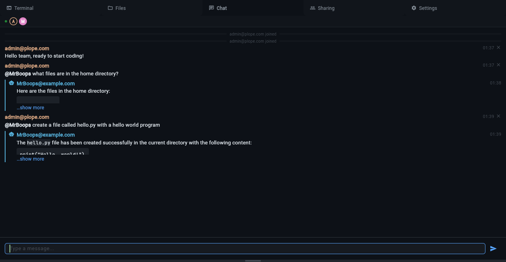

# Chat

Per-workspace chat panel with real-time messaging. All workspace members
see messages instantly via WebSocket. Click the **Chat** tab to open.





## Sending Messages

Type in the input field at the bottom and press **Enter** to send. Messages
are rendered as Markdown — code blocks get syntax highlighting, links are
clickable, and inline formatting (bold, italic, code) works.

- **Shift+Enter** inserts a newline (multi-line messages)
- **Up/Down arrows** recall previously sent messages
- **Ctrl+A/E/K** emacs-style editing in the input field

## @Mentions

Type `@` followed by a workspace member's email to mention them. Tab
completion suggests matching members. Mentions are stored and the mentioned
user is notified on their next connection.

## AI Agent (@MrBoops)

Every workspace has an AI agent named **MrBoops** that can answer questions
about the workspace, run commands in the terminal, and create or modify
files.

To interact with the agent, mention it in chat:

```text
@MrBoops what files are in the home directory?
```

The agent runs inside the workspace container with full access to the
terminal and filesystem. It can:

- List and read files
- Create and edit files
- Run shell commands
- Answer questions about the project



### Follow-up Conversations

After an @MrBoops mention, your subsequent messages automatically route to
the agent — you don't need to @mention it again. The conversation continues
until another user speaks (interjection) or you @mention someone else.

### Configuration

The agent requires an LLM backend. Set these environment variables:

- `KLANGK_LLM_BASE_URL` — OpenAI-compatible API endpoint
- `KLANGK_LLM_MODEL` — model name (e.g. `gemma4:31b`)
- `KLANGK_LLM_API_KEY` — API key (optional, depends on provider)

Without these, the agent is unavailable and @MrBoops mentions are ignored.

### Agent Identity

The agent's handle and email are configured via environment variables and
seeded into the database on first startup:

| Variable                   | Default               |
| -------------------------- | --------------------- |
| `KLANGK_CHAT_AGENT_HANDLE` | `MrBoops`             |
| `KLANGK_CHAT_AGENT_EMAIL`  | `MrBoops@example.com` |

After seeding, the agent identity is read from the database. Changing
these env vars and restarting will update the agent's record in the
database. The agent user cannot have a password and cannot log in via
credentials.

## Message Types

- **User messages** — sent by workspace members, shown with email and timestamp
- **Agent messages** — sent by MrBoops, shown with a robot icon in cyan
- **System messages** — join/leave notifications, centered and muted

## Message Deletion

Click the **✕** next to your own message to delete it. Deleted messages
are soft-deleted — the text is replaced with a placeholder but the
message entry remains in the history.

## Container-to-Chat API

Processes inside the workspace container can post messages to chat via:

```text
POST /api/workspace/post-chat-message
```

This is how the AI agent sends its responses. The endpoint is authenticated
via the workspace JWT and restricted by nginx IP ACL to container traffic
only.
