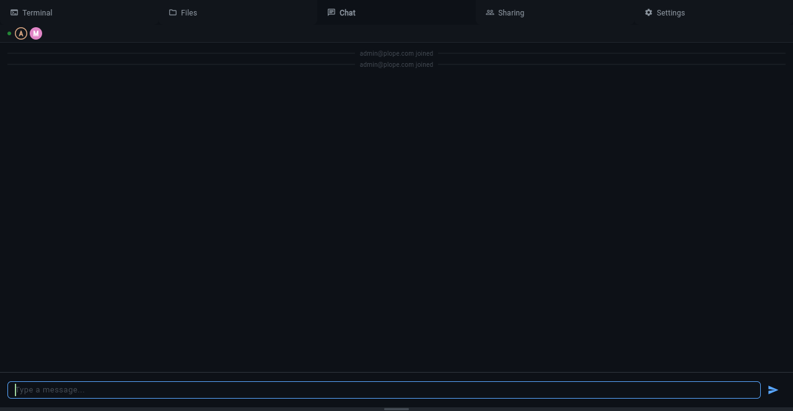
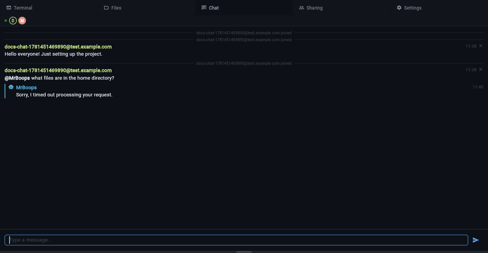
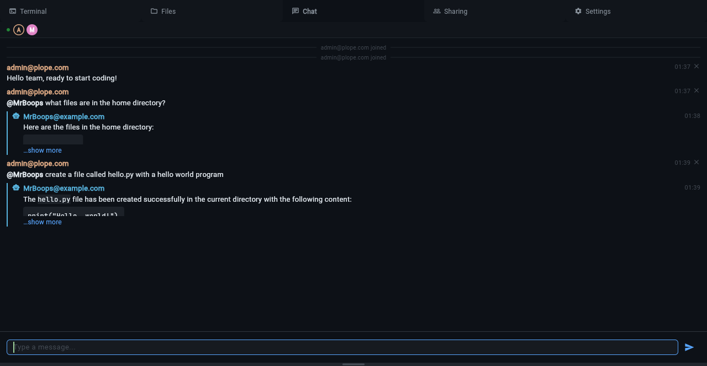

# Chat

Per-workspace chat panel with real-time messaging. All workspace members
see messages instantly via WebSocket. Click the **Chat** tab to open.

!!! note
Chat is per-workspace only — there are no direct messages (DMs)
between users. Use separate workspaces for private conversations.

[](../assets/chat/01-chat-panel.png)

[](../assets/chat/03-agent-response.png)

## Sending Messages

Type in the input field at the bottom and press **Enter** to send. Messages
are rendered as Markdown — code blocks get syntax highlighting, links are
clickable, and inline formatting (bold, italic, code) works.

- **Shift+Enter** inserts a newline (multi-line messages)
- **Up/Down arrows** recall previously sent messages
- **Ctrl+A/E/K** emacs-style editing in the input field

## @Mentions

Type `@` followed by a workspace member's email to mention them. Tab
completion suggests matching members. Mentions are stored and the mentioned
user is notified on their next connection.

## AI Agent (@clanker)

Every workspace has an AI agent named **clanker** that can answer questions
about the workspace, run commands in the terminal, and create or modify
files.

To interact with the agent, mention it in chat:

```text
@clanker what files are in the home directory?
```

The agent runs inside the workspace container with full access to the
terminal and filesystem. It can:

- List and read files
- Create and edit files
- Run shell commands
- Answer questions about the project

[](../assets/chat/04-agent-conversation.png)

### What the agent is (and isn't)

The chat agent is a **fixed, built-in assistant** scoped to a single
workspace. It is not a coding-agent harness you configure or extend:

- **No tool calling.** It has no pluggable tool interface. The
  filesystem and terminal access above is what `pi` provides as part of
  its standard operation, not a configurable tool set.
- **No custom skills or prompts.** You cannot add skills, instructions,
  or system prompts to the chat agent. Its system prompt is fixed by
  Klangk. (For a full, extensible agent you can drive yourself with your
  own skills and prompts, run your own agent in a terminal instead — see
  [AI coding harnesses](ai-coding-harnesses.md).)

The chat agent also has **no direct access to the chat history stored in
Klangk's database** — it cannot read what humans have said to one another
in the chat panel. On each `@clanker` mention it receives, at most, a
narrow slice of context: messages from _other_ participants posted since
the agent's last response (capped, and with no timestamps). Pi's own
multi-turn memory covers only the back-and-forth between the mentioning
user and the agent.

The practical upshot: the agent **cannot summarize or answer questions
about the human-to-human chat discussion** as a whole. Asking it to
"summarize the conversation so far" or "what did everyone decide earlier"
will not work — it simply does not have that information. It is best
suited to direct, self-contained requests: "write a script that does X",
"what's in this file", "run the tests".

### Follow-up Conversations

After an @clanker mention, your subsequent messages automatically route to
the agent — you don't need to @mention it again. The conversation continues
until another user speaks (interjection) or you @mention someone else.

### Configuration

The agent requires an LLM backend. Set these environment variables:

- `KLANGKD_LLM_BASE_URL` — OpenAI-compatible API endpoint
- `KLANGKD_LLM_MODEL` — model name (e.g. `gemma4:31b`)
- `KLANGKD_LLM_API_KEY` — API key (optional, depends on provider)

Without these, the agent is unavailable and @clanker mentions are ignored.

### Agent identity + enabling

The clanker agent is **opt-in** (#1977): its `pi --mode rpc` subprocess
spawns only when the `chat` feature is active (`KLANGKD_FEATURES_ENABLE`)
**and** the agent is enabled. The enable flag and the agent's identity
(handle + email) are chat-feature config keys, resolved the standard way
(env → the `features_config:` block of `klangkd.yaml` → feature default).

These are **two independent switches**, not one. Turning the `chat` feature
on (`KLANGKD_FEATURES_ENABLE=chat`) surfaces the chat tab; it does **not** start
the agent. The agent starts only when `chat` is active **and**
`KLANGKWS_FEATURE_CHAT_AGENT_ENABLED` is set — so _chat tab on, agent off_ is a
normal state (the chat surface is visible, but `@clanker` mentions are ignored
until the agent is enabled):

| Key                                   | Default               | Effect                                                                                                   |
| ------------------------------------- | --------------------- | -------------------------------------------------------------------------------------------------------- |
| `KLANGKWS_FEATURE_CHAT_AGENT_ENABLED` | (unset = off)         | Set to `1`/`true`/`yes` to enable the agent. Off (or `chat` inactive) → the subprocess is never spawned. |
| `KLANGKWS_FEATURE_CHAT_AGENT_HANDLE`  | `clanker`             | The agent's @mention handle.                                                                             |
| `KLANGKWS_FEATURE_CHAT_AGENT_EMAIL`   | `clanker@example.com` | The agent's email.                                                                                       |

The identity is seeded into the database on startup and re-seeded on
SIGHUP (so changing a key + reload updates the agent's record). The agent
user cannot have a password and cannot log in via credentials.

@mention autocomplete suggests only users who are **present** (a
@mention is a synchronous act delivered to currently-connected sockets;
there's no async delivery for offline members). Because the agent's
presence is driven by whether its subprocess is alive, a disabled agent
is simply never suggested — it disappears from autocomplete with no
special-case gate. (Manually typing a full-handle `@clanker` would still
route to the agent and surface the refused-to-start error, but the
autocomplete affordance for it is gone.)

This is a **global** setting that affects every workspace; toggling it
takes effect on the next subprocess start (no server restart needed for
the start refusal itself). Per-workspace control is tracked separately
in [#1142](https://github.com/mcdonc/klangk/issues/1142) (and depends
on the per-workspace settings infrastructure,
[#864](https://github.com/mcdonc/klangk/issues/864)).

## Message Types

- **User messages** — sent by workspace members, shown with email and timestamp
- **Agent messages** — sent by clanker, shown with a robot icon in cyan
- **System messages** — join/leave notifications, centered and muted

## Message Deletion

Click the **✕** next to your own message to delete it. Deleted messages
are soft-deleted — the text is replaced with a placeholder but the
message entry remains in the history.

## Container-to-Chat API

Processes inside the workspace container can post messages to chat via:

```text
POST /api/v1/workspaces/post-chat-message
```

This is how the AI agent sends its responses. The endpoint is authenticated
via the workspace JWT and restricted by the proxy IP ACL to container traffic
only.
