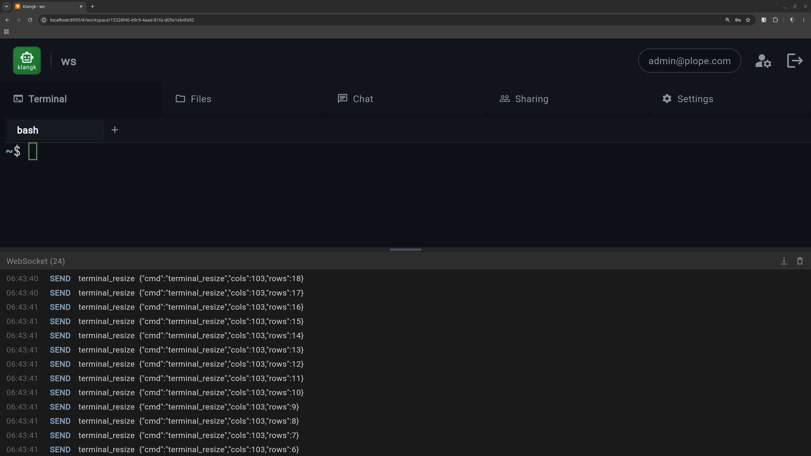

# Debug Panel

The debug panel shows real-time WebSocket activity between the browser
and the backend. It is always collecting events, even before you first
open it.

- Container lifecycle events (starting, ready with port info and
  status, idle stop, restart)
- Session resume notifications
- Query text shown for each prompt sent
- Tool call entries from Pi (including extension tools)
- Error entries
- Timestamps and color-coded entries
- Selectable text for titles and content
- Clear button
