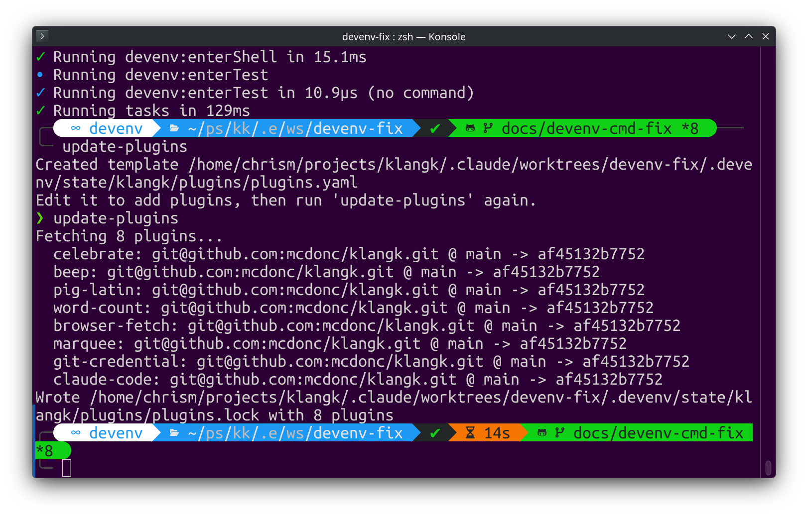

# Feature Activation

Klangk ships a set of **features** — tools, UI widgets, and container
customizations that extend workspaces. A feature can add a browser UI widget
(confetti, beeps), a Pi agent tool (file stats, authenticated fetch), a CLI
agent baked into the image (Claude Code), or git/system configuration.

> **Same unit, two audiences.** A **feature** is authored as a directory
> under `features/<name>/` (Dart `ToolPlugin` code, a Pi `extension.ts`,
> lifecycle hooks, etc.). At build time features are compiled into the image;
> at deploy time, `KLANGK_FEATURES_ENABLE` controls which compiled-in features
> are turned on. (The `ToolPlugin` base class and the `klangk_plugin_api`
> package keep their names — they live in an external package — but everywhere
> else the unit is a "feature".) This page covers the activation surface; for
> per-user, per-workspace runtime additions that need no rebuild, see
> [Sandboxes](sandbox.md).

## Compiled-in vs. activated

There are two lists, and they are allowed to differ
([#1655](https://github.com/mcdonc/klangk/issues/1655)):

- **Compiled-in** — what a build bakes into the image. The source of truth is
  the checked-in [`features.yaml`](../../features.yaml) at the repo root; the
  build (`update_features.py`) materializes each declared feature into a
  throwaway payload dir and compiles it into the frontend + workspace image. The
  build also emits a `features.json` manifest (next to the frontend's
  `index.html`) carrying each compiled-in feature's metadata, a `defaults`
  list, and the container-env keys it declares.
- **Activated** — which compiled-in features are turned **on** for this deploy.
  Set deploy-wide with `KLANGK_FEATURES_ENABLE`. The frontend reads its sibling
  `features.json` for metadata + defaults, and `KLANGK_FEATURES_ENABLE`
  (forwarded verbatim via `GET /api/v1/config`) for the deploy's chosen set,
  then filters before registering anything (`main.dart`). The server does no
  activation itself — it owns only the config-value bridge.

Compiled-in is a strict superset of the default-on set: a feature can ship
**dormant** (compiled in, but not turned on by default) and be opted into per
deploy _without a rebuild_. Adding a brand-new feature, by contrast, is a
build-time change (declare it in `features.yaml` and rebuild).

> **Features vs. sandboxes.** Features are compiled into the workspace image at
> build time, so what they add is available across the whole deployment and is
> switched on/off deploy-wide. [Sandboxes](sandbox.md) are the runtime
> counterpart: software and configuration scoped to a _particular user within a
> particular workspace_, applied at workspace-create time with no rebuild.

## Turning features on (`KLANGK_FEATURES_ENABLE`)

Canonical semantics ([#1655](https://github.com/mcdonc/klangk/issues/1655)):

- **Unset** → the manifest's `defaults` list (the stock known-good set). This
  is backwards-compatible — a bare install gets the default features.
- **Any explicit value** → **exactly** that comma-separated list, nothing
  implied. There is no `*`/wildcard form. Listing a single feature turns _off_
  every other feature, so to add one you compose it with the stock set.

Because an explicit value is the exact active list (not additive), opting a
dormant feature in means listing it alongside the defaults you want to keep:

```bash
# turn on soliplex while keeping the stock set
KLANGK_FEATURES_ENABLE=beep,bobdobbs,boingball,browser-fetch,celebrate,git-credential,soliplex
```

Read at boot and on `SIGHUP` (reloadable). When the upstream `defaults` change,
a pinned list does not pick up the change — re-pin deliberately. See
[Environment Variables](../reference/environment.md) for the full row, and
[Configuration File](../reference/klangkd-config.md) for the `features_enable`
config-file key.

## Default features

[](../assets/boing-ball.png)

These six are compiled in and active by default (the manifest's `defaults`
list):

| Feature          | What it does                                                |
| ---------------- | ----------------------------------------------------------- |
| `beep`           | Plays an audible beep via the Web Audio API                 |
| `bobdobbs`       | Bob "J.R." Dobbs quote overlay, triggered from Pi           |
| `boingball`      | Bouncing Boing Ball animation overlay, triggered from Pi    |
| `browser-fetch`  | HTTP fetch using the browser's session cookies, from Pi     |
| `celebrate`      | Confetti animation in the browser, triggered from Pi        |
| `git-credential` | Git credential helper with a browser-based PAT/OAuth dialog |

## Compiled-in but dormant

These ship compiled into the image but are **not** in the default-on set, so a
bare install does not surface them. Opt in by adding them to
`KLANGK_FEATURES_ENABLE` (composed with the stock set, as above).

| Feature      | What it does                                                                                                    | Activate                                     |
| ------------ | --------------------------------------------------------------------------------------------------------------- | -------------------------------------------- |
| `word-count` | File-stats tool for Pi (lines, words, characters, size) ([#1700](https://github.com/mcdonc/klangk/issues/1700)) | add `word-count` to `KLANGK_FEATURES_ENABLE` |
| `soliplex`   | Soliplex knowledge-base tools (list/query/reply, multi-turn RAG)                                                | add `soliplex` to `KLANGK_FEATURES_ENABLE`   |

### `soliplex`

The Soliplex org's knowledge-base feature (list/query/reply, multi-turn RAG),
vendored into this repo under `features/soliplex/`
([#1686](https://github.com/mcdonc/klangk/issues/1686); upstream
[`soliplex/klangk-plugin-soliplex`](https://github.com/soliplex/klangk-plugin-soliplex)
`v0.4`). It is dormant by default because it needs a running Soliplex server to
be useful — defaulting it on would surface a dead tool to every install. Its
one config key, `KLANGK_FEATURE_SOLIPLEX_URL` (scope `frontend`), is resolved
server-side and surfaced to the UI as `soliplex_url` via `GET /api/v1/config`
when the feature is active; nothing is injected into workspace containers (it
is a browser-side feature).

**Workspace-side caveat:** dormancy governs the **frontend** (the Dart UI and
its tools). The workspace container bundles every compiled-in feature's
`extension.ts` into `/opt/klangk/pi-agent/extensions/`, and Pi loads that
directory unconditionally — so a workspace pi agent registers soliplex's
`soliplex_*` tools regardless of `KLANGK_FEATURES_ENABLE`. They self-no-op when
no Soliplex server is reachable, so they are harmless on a non-Soliplex
install, but they do appear in the tool list. Per-feature workspace-side gating
is a follow-up, not part of the current model.

## Additional features (not compiled in by default)

These ship in the repo under `features/` but are **not** declared in the default
`features.yaml`, so a stock build does not compile them in. To use one, add it
to `features.yaml` and rebuild the image:

| Feature       | What it does                                                                       |
| ------------- | ---------------------------------------------------------------------------------- |
| `claude-code` | Installs the Claude Code CLI agent at image build time                             |
| `herdr`       | Installs herdr (terminal-based agent runtime) and sets up its per-shell API socket |
| `pig-latin`   | Text-to-Pig-Latin converter for Pi                                                 |

```yaml
# features.yaml — append to compile an additional feature in
features:
  - name: claude-code
    path: features/claude-code
```

## Declaring features at build time

[](../assets/update-features.png)

The checked-in [`features.yaml`](../../features.yaml) at the repo root is the
source of truth for what a build compiles. Each entry is either a _local path_
(the feature tree lives in this repo under `features/<name>/`, symlinked straight
in) or a _remote git ref_ (`git:` + `ref:`, which `update-features` clones and
SHA-pins into `features.lock`):

```yaml
features:
  - name: celebrate # local, in-tree
    path: features/celebrate
  - name: my-feature # local, arbitrary path
    path: /home/user/projects/my-feature
  - name: third-party # remote
    git: https://github.com/org/klangk-feature-third-party.git
    ref: main
```

Paths support `~` and `$ENV_VAR` expansion; relative paths resolve from the
repo root (where `features.yaml` lives). The build materializes the payload into
a throwaway, build-owned dir ([#1660](https://github.com/mcdonc/klangk/issues/1660))
— not next to the source tree — then compiles it into the frontend + workspace
image and emits `features.json`.

- `update-features` — fetches every feature in `features.yaml`, resolves git refs
  to commit SHAs, writes `features.lock`.
- `update-features <name>` — fetch/update a single feature by name.
- `features.lock` — records resolved commit SHAs for reproducible builds.
- Under `devenv`, `klangk:update-features` re-materializes the payload when the
  checked-in `features.yaml` or anything under `features/**/` changes.

> **Remote features are off by default in CI/builds.** The build scripts run
> `update_features.py --local-only`, so git-sourced features are skipped unless
> you set `KLANGK_BUILD_INCLUDE_REMOTE=1`. No feature in the default
> `features.yaml` is git-sourced today, so this is a no-op for stock builds.

## Feature configuration

A feature can declare configuration keys (e.g. an OAuth client ID, a RAG
endpoint URL) in its `package.json` under `klangk.config`. Declarations are
collected at build time into `features.json`; the server resolves each key's
value at runtime and bridges it to where the feature needs it
([#1655](https://github.com/mcdonc/klangk/issues/1655),
[#1662](https://github.com/mcdonc/klangk/issues/1662)):

- Every declared key is namespaced under the `KLANGK_FEATURE_` prefix (e.g.
  `KLANGK_FEATURE_SOLIPLEX_URL`). The prefix alone keeps feature config from
  colliding with server settings (`KLANGK_<SETTING>`) — no reserved set needed.
- **`scope`** controls where the value lands: `container` → injected as an env
  var into workspace containers; `frontend` → surfaced as a lowercased key in
  `GET /api/v1/config` (e.g. `KLANGK_FEATURE_SOLIPLEX_URL` → `soliplex_url`);
  `both` → both.
- **Value precedence**, highest to lowest when a key is resolved: the env var,
  then the `features_config:` block in `klangkd.yaml`
  ([#1659](https://github.com/mcdonc/klangk/issues/1659)), then the
  feature-declared default. Env stays the escape hatch for per-invocation
  overrides.

For the operator-facing config rows see
[Environment Variables](../reference/environment.md) and
[Configuration File](../reference/klangkd-config.md#feature-configuration-features_config).
