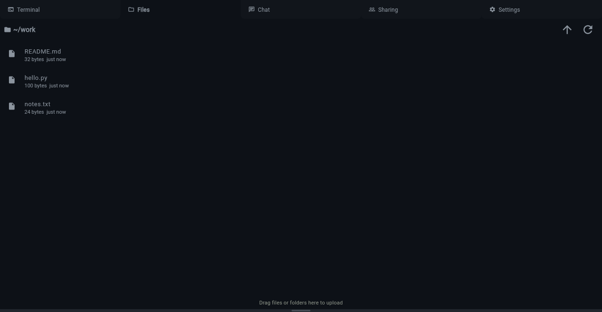
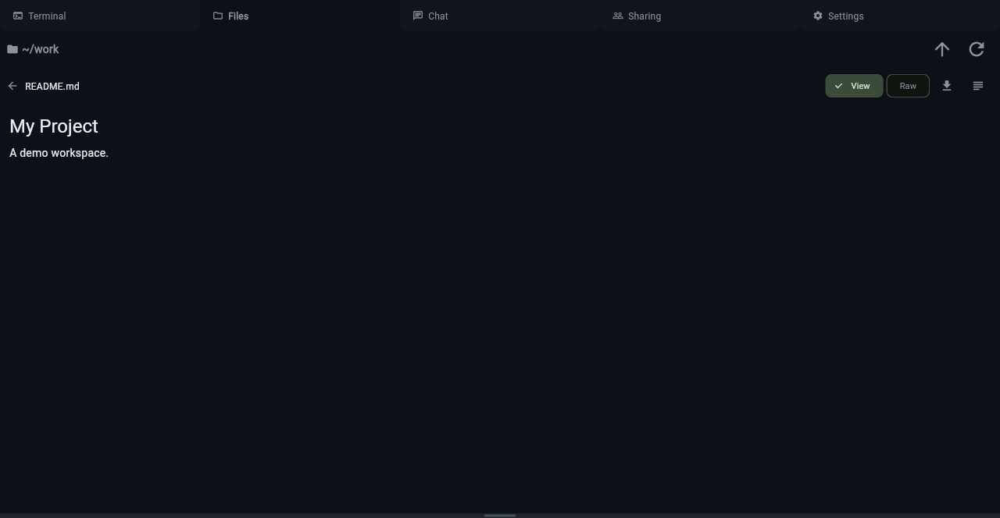

# Files

The Files tab provides a file browser for your workspace container.
Browse directories, view file contents, and upload or download files —
all without using the terminal.

Click the **Files** tab in the workspace to open.

## Browsing

The file browser starts at `/home/work` but can navigate the entire
container filesystem. Click a directory to enter it, or click a file
to preview its contents.

- **Path bar** at the top shows the current absolute path with
  clickable breadcrumbs. Click any segment to navigate to that
  directory, or use the up-arrow button to go up one level.
- **Home button** (house icon) returns to `/home/work`.
- **Navigate to root** — click the leading `/` in the breadcrumbs or
  use the up-arrow repeatedly to reach `/`. From there you can browse
  shared bind-mounted directories (e.g. `/mnt/data`), system
  directories, or any other part of the container filesystem.
- **File sizes** are shown next to each entry.
- **Auto-refresh** — the file list refreshes automatically when Pi
  creates, edits, or deletes files, and when you switch to the Files
  tab.

!!! note
The file browser requires a running container. If the container is
stopped (e.g. due to idle timeout), start it by switching to the
Terminal tab first.

## Uploading Files

Drag and drop files or folders onto the file browser to upload them.
Uploads go into the currently viewed directory (not always root).

- **Folder upload** preserves directory structure
- **Progress indicator** shows upload status
- **Duplicate detection** — blocks upload if a file or folder with
  the same name already exists
- Maximum upload size: 500 MB (configurable via `KLANGKD_IMPORT_MAX_SIZE`)

## Downloading

Right-click a file or folder to open the context menu:

- **Download** — downloads the file directly (streamed)
- **Download folder** — downloads the folder as a `.tar.gz` archive
  (streamed from the container)

## File Preview

Click a file to view its contents in a read-only viewer with syntax
highlighting (JetBrains Mono font). Toggle between rendered **View**
and **Raw** modes using the buttons at the top right.

Supported previews include:

- Source code files with syntax highlighting
- Text files
- Images
- PDF documents

## Context Menu

Right-click any file or folder for these actions:

- **Download** — download the file or folder
- **Rename** — rename with an inline dialog
- **Delete** — delete with confirmation prompt
