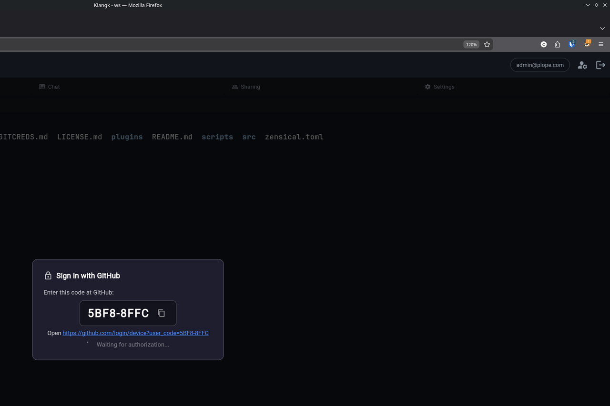
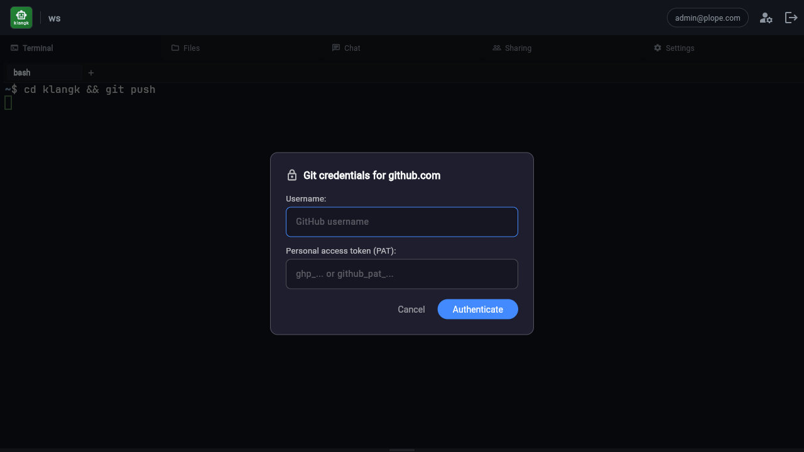

# GitHub Authentication

Klangk workspaces can authenticate with GitHub for HTTPS git operations
(push, pull, clone of private repos). Two methods are available:

- **Sign in with GitHub** (recommended) — OAuth device flow, no token
  management required. Requires admin configuration.
- **Personal access token (PAT)** — manual token entry, always available
  as a fallback.

When git needs credentials, a dialog appears in your browser tab — no
need to paste tokens into the terminal.

## Setup

The `git-credential` plugin must be included in your plugins list. If
you're using the default plugin set, it's already there. Otherwise, add
it to your `plugins.yaml`:

```yaml
plugins:
  - name: git-credential
    git: git@github.com:mcdonc/klangk.git
    path: plugins/git-credential
    ref: main
```

Then run `update-plugins` and rebuild the workspace image (`devenv up`
will do both automatically).

## Sign in with GitHub (recommended)

When the admin has configured GitHub OAuth (see
[Admin setup](#admin-setup-creating-a-github-oauth-app) below), running
a git command that requires authentication for `github.com` triggers
the device flow automatically.

### How it works

1. Run a git command that requires authentication:

   ```sh
   git push
   ```

2. A popup window opens at GitHub's device authorization page with the
   code pre-filled. A dialog in the Klangk tab shows the code and a
   spinner while waiting for authorization.

   

3. Authorize the app in the popup window. The credential helper detects
   authorization automatically — the dialog dismisses and git proceeds.

The entire device flow runs inside the workspace container. The
container-side credential helper (`git-credential-klangk`) talks to
GitHub directly, and only sends the display code to the browser for the
user to see. The access token never leaves the container — it goes
straight from GitHub to git via the helper's stdout.

If the device flow fails (network error, expired code, denied), the
helper falls back to the PAT dialog automatically.

### Scopes

The device flow requests the `repo` scope, which grants read/write
access to repositories you can access on GitHub. The token is scoped to
the OAuth App — it cannot access organization resources unless the
organization has approved the app.

### When does the device flow activate?

The device flow only activates when all of these are true:

- `KLANGK_GITHUB_OAUTH_CLIENT_ID` is set in the container environment
- The git host is `github.com` (or `www.github.com`)
- A browser tab is connected (the helper needs to show the code)

For non-GitHub hosts, or when the client ID is not configured, the
helper falls through to the PAT dialog.

## Using a personal access token

If GitHub OAuth is not configured, or for non-GitHub hosts, the
credential dialog shows username and PAT fields:



### Generating a GitHub PAT

The credential helper needs a **fine-grained personal access token**
with repository access. To create one:

1. Go to <https://github.com/settings/tokens?type=beta> (or navigate to
   **Settings > Developer settings > Personal access tokens > Fine-grained tokens**).
2. Click **Generate new token**.
3. Give it a descriptive name (e.g. "Klangk workspace").
4. Set an expiration. GitHub allows up to 1 year.
5. Under **Repository access**, choose either:
   - **All repositories** — if you want to push/pull from any repo.
   - **Only select repositories** — pick the specific repos you need.
6. Under **Permissions > Repository permissions**, grant:
   - **Contents**: Read and write (required for push/pull).
   - **Metadata**: Read-only (required by GitHub for all fine-grained tokens).
7. Click **Generate token**.
8. **Copy the token immediately** — GitHub will not show it again.

The token starts with `github_pat_` (fine-grained) or `ghp_` (classic).
Both formats work. Classic tokens also work but fine-grained tokens are
recommended because they can be scoped to specific repositories.

### Using the PAT

1. Open a workspace and run a git command that requires authentication.
2. Enter your GitHub username and paste the PAT.
3. Click **Authenticate**.

On subsequent git operations to the same host, the cached credentials
are reused automatically — no dialog appears. The cache lasts until you
refresh the page or close the tab.

## Admin setup: creating a GitHub OAuth App

To enable "Sign in with GitHub" for your Klangk instance, you need to
create a GitHub OAuth App and set one environment variable.

1. Go to **GitHub > Settings > Developer settings > OAuth Apps**.
2. Click **New OAuth App** (or **Register a new application**).
3. Fill in the form:
   - **Application name**: e.g. "Klangk — My Instance"
   - **Homepage URL**: your Klangk instance URL (e.g.
     `https://klangk.example.com`)
   - **Authorization callback URL**: use your instance URL (e.g.
     `https://klangk.example.com`). The device flow does not use
     redirects, but GitHub requires this field.
4. Check **Enable Device Flow** on the registration form.
5. Click **Register application**.
6. Copy the **Client ID** (you do not need the client secret — the
   device flow is designed for public clients).
7. Set the environment variable in your deployment:

   ```sh
   KLANGK_GITHUB_OAUTH_CLIENT_ID=Ov23li...
   ```

8. Rebuild the workspace image so the variable is injected into
   containers. The device flow will activate automatically for
   `github.com` hosts.

**Important**: this must be an **OAuth App**, not a GitHub App. The
device authorization grant is only available on OAuth Apps.

If `KLANGK_GITHUB_OAUTH_CLIENT_ID` is not set, the device flow is
disabled and the PAT dialog is used for all hosts.

## Credential cache

The PAT cache is **per-tab** and **in-memory only**:

- Each browser tab has its own `GitCredentialPlugin` instance with its
  own cache. Credentials entered in tab A are not available in tab B.
- Refreshing the page clears the cache (new plugin instance).
- Closing the tab clears the cache.
- The cache is keyed by `protocol://host` (e.g. `https://github.com`).

Device flow tokens are not cached in the browser — the token goes
directly from the container helper to git. However, after a successful
`git push`, git calls the helper's `store` operation, which caches the
credentials in the browser for subsequent operations within the same
session.

## Multiple browser tabs

If you have two browser tabs open on the same workspace, the credential
dialog appears in whichever tab you most recently clicked into. Both
tabs share the same terminal session, but each maintains its own
credential cache. Switching tabs and running git will prompt for
credentials again if that tab's cache is empty.

## SSH alternative

If you prefer SSH authentication over HTTPS, you can configure your git
remotes to use SSH URLs (`git@github.com:...`) instead. The credential
helper only activates for HTTPS URLs.

Note that there is currently no way to keep your GitHub private key
secure in a Klangk instance — any SSH key placed in the container is
accessible to anyone with access to the workspace. For this reason,
HTTPS with PATs or OAuth is the recommended authentication method.

## Troubleshooting

### Dialog doesn't appear

- Make sure the `git-credential` plugin is installed (check that
  `klangk-browser-id` is on PATH inside the container).
- Verify the browser tab has a WebSocket connection (check for
  errors in the browser console).

### Device flow not activating

- Verify `KLANGK_GITHUB_OAUTH_CLIENT_ID` is set in the container
  environment (check with `echo $KLANGK_GITHUB_OAUTH_CLIENT_ID` in the
  workspace terminal).
- Check that the OAuth App has **Enable Device Flow** turned on.
- The device flow only activates for `github.com` hosts.
- Rebuild the workspace image after setting the variable.

### Device flow code expired

The code is valid for 15 minutes. If it expires before you authorize,
the helper falls back to the PAT dialog. Run the git command again to
get a new code.

### Credentials rejected

- Verify your PAT hasn't expired.
- Check that the token has **Contents: Read and write** permission.
- For fine-grained tokens, verify the target repository is included.
- Try generating a new token.

### Debug output

Run with debug logging to see the credential helper's activity:

```sh
export GIT_CREDENTIAL_KLANGK_DEBUG=1
git push
```

This prints the browser ID, the bridge request/response, device flow
status, and any errors to stderr.
