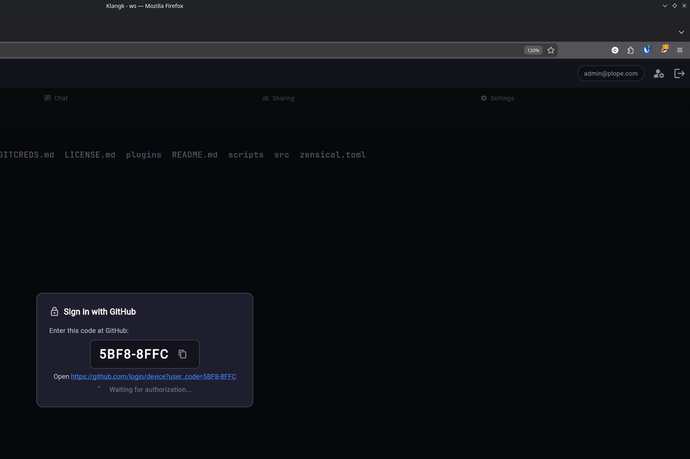
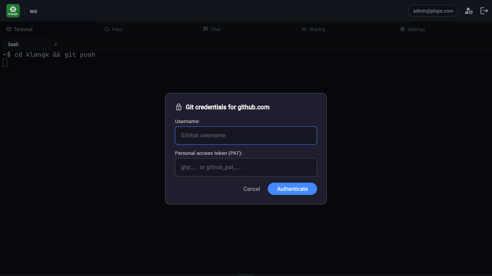

# GitHub HTTPS Authentication

Klangk workspaces can authenticate with GitHub for HTTPS git operations
(push, pull, clone of private repos). Two methods are available:

- **Sign in with GitHub** (recommended) — OAuth device flow, no token
  management required. Requires admin configuration.
- **Personal access token (PAT)** — manual token entry, always available
  as a fallback.

When git needs credentials, a dialog appears in your browser tab — no
need to paste tokens into the terminal.

## Setup

The `git-credential` feature must be included in your features list. If
you're using the default feature set, it's already there. Otherwise, add
it to your `features.yaml`:

```yaml
features:
  - name: git-credential
    path: features/git-credential
```

Then run `update-features` to materialize the feature payload, then rebuild
the workspace image (`build-workspace-image`).

## Sign in with GitHub (recommended)

When the GitHub OAuth client ID is configured — deploy-wide by the
admin (see [Admin setup](#admin-setup-creating-a-github-oauth-app)
below), per workspace, or ad hoc in a shell (see
[Ways to set the client ID](#ways-to-set-the-client-id)) — running a
git command that requires authentication for `github.com` triggers
the device flow automatically.

### How it works

1. Run a git command that requires authentication:

   ```sh
   git push
   ```

2. A popup window opens at GitHub's device authorization page. A dialog
   in the Klangk tab shows the code with a copy button and a spinner
   while waiting for authorization.

   

3. Copy the code from the dialog (click the copy icon), paste it into
   the GitHub page, and authorize the app. The credential helper detects
   authorization automatically — the dialog dismisses and git proceeds.

The entire device flow runs inside the workspace container. The
container-side credential helper (`git-credential-klangk`) talks to
GitHub directly, and only sends the display code to the browser for the
user to see. The access token goes straight from GitHub to git via the
helper's stdout — it is never displayed. After a successful
authenticated operation, git calls the helper's `store` operation,
which places the credential in the browser tab's in-memory cache so
subsequent operations in that tab reuse it without a new login (see
[Credential cache](#credential-cache) for lifetime and scope).

If the device flow fails (network error, expired code, denied), the
helper falls back to the PAT dialog automatically.

### Scopes

The device flow requests the `repo` scope, which grants read/write
access to repositories you can access on GitHub. The token is scoped to
the OAuth App — it cannot access organization resources unless the
organization has approved the app.

### When does the device flow activate?

The device flow only activates when all of these are true:

- A provider is configured for the host — a
  `KLANGKWS_FEATURE_OAUTH_PROVIDERS` entry whose `host` matches, or one
  of the shorthands: `KLANGKWS_FEATURE_GITHUB_OAUTH_CLIENT_ID` for
  GitHub, `KLANGKWS_FEATURE_GITLAB_OAUTH_CLIENT_ID` for gitlab.com
- The git host matches the provider's `host` — any spelling counts:
  case (`GitHub.com`), explicit port (`github.com:443`), a trailing dot
  (`github.com.`), and a `www.` prefix all match
- A browser tab is connected (the helper needs to show the code)

For hosts without a configured provider, the helper falls through to the
PAT dialog.

### Ways to set the client ID

`KLANGKWS_FEATURE_GITHUB_OAUTH_CLIENT_ID` can come from three levels.
Where several apply, the narrower one wins (the per-workspace value is
injected after — and so overrides — the deploy-wide value; a shell
export shadows both for commands run from that shell):

1. **Deploy-wide (admin).** The `features_config:` block of
   `klangkd.yaml` (`github_oauth_client_id: "Ov23li..."`) or the
   `KLANGKWS_FEATURE_GITHUB_OAUTH_CLIENT_ID` environment variable on
   the server. Injected into every workspace container at start. See
   [Admin setup](#admin-setup-creating-a-github-oauth-app).
2. **Per workspace.** The workspace's environment settings (the `env`
   map on workspace create/edit, e.g.
   `KLANGKWS_FEATURE_GITHUB_OAUTH_CLIENT_ID=Ov23li...`).
   Useful for testing or when only one workspace should use GitHub
   OAuth. Takes effect the next time the workspace container starts
   (restart the workspace after changing it) and survives restarts of
   that workspace. Stripped on export/import — an imported copy falls
   back to the deploy-wide value.
3. **Ad hoc, in a shell.** Inside the workspace terminal:

   ```sh
   export KLANGKWS_FEATURE_GITHUB_OAUTH_CLIENT_ID=Ov23li...
   git push
   ```

   Takes effect immediately for git commands run from that shell — no
   container restart needed — but is gone when the shell or the
   workspace restarts.

In all three cases the value only needs to be the OAuth App's **client
ID** — no client secret is ever needed (the device flow is designed for
public clients).

## Using a personal access token

If GitHub OAuth is not configured, or for non-GitHub hosts, the
credential dialog shows username and PAT fields:

[](../assets/github-auth/01-credential-dialog.png)

### Generating a GitHub PAT

The credential helper needs a **fine-grained personal access token**
with repository access. To create one:

1. Go to <https://github.com/settings/tokens?type=beta> (or navigate to
   **Settings > Developer settings > Personal access tokens > Fine-grained tokens**).
2. Click **Generate new token**.
3. Give it a descriptive name (e.g. "Klangk workspace").
4. Set an expiration. GitHub allows up to 1 year.
5. Under **Repository access**, choose either:
   - **All repositories** — if you want to push/pull from any repo.
   - **Only select repositories** — pick the specific repos you need.
6. Under **Permissions > Repository permissions**, grant:
   - **Contents**: Read and write (required for push/pull).
   - **Metadata**: Read-only (required by GitHub for all fine-grained tokens).
7. Click **Generate token**.
8. **Copy the token immediately** — GitHub will not show it again.

The token starts with `github_pat_` (fine-grained) or `ghp_` (classic).
Both formats work. Classic tokens also work but fine-grained tokens are
recommended because they can be scoped to specific repositories.

### Using the PAT

1. Open a workspace and run a git command that requires authentication.
2. Enter your GitHub username and paste the PAT.
3. Click **Authenticate**.

On subsequent git operations to the same host, the cached credentials
are reused automatically — no dialog appears. The cache lasts until you
refresh the page or close the tab.

## Admin setup: creating a GitHub OAuth App

To enable "Sign in with GitHub" for your Klangk instance, you need to
create a GitHub OAuth App and set one environment variable.

1. Go to **GitHub > Settings > Developer settings > OAuth Apps**.
2. Click **New OAuth App** (or **Register a new application**).
3. Fill in the form:
   - **Application name**: e.g. "Klangk — My Instance"
   - **Homepage URL**: your Klangk instance URL (e.g.
     `https://klangk.example.com`)
   - **Authorization callback URL**: use your instance URL (e.g.
     `https://klangk.example.com`). The device flow does not use
     redirects, but GitHub requires this field.
4. Check **Enable Device Flow** on the registration form.
5. Click **Register application**.
6. Copy the **Client ID** (you do not need the client secret — the
   device flow is designed for public clients).
7. Set the environment variable in your deployment:

   ```sh
   KLANGKWS_FEATURE_GITHUB_OAUTH_CLIENT_ID=Ov23li...
   ```

8. The variable is injected into workspace containers at **start** —
   no image rebuild is needed. Restart existing workspaces (or open a
   new one) and the device flow will activate automatically for
   `github.com` hosts.

**Important**: this must be an **OAuth App**, not a GitHub App. The
device authorization grant is only available on OAuth Apps.

If `KLANGKWS_FEATURE_GITHUB_OAUTH_CLIENT_ID` is not set, the device flow is
disabled for GitHub and the PAT dialog is used for all hosts.

## Other git hosts: GitLab, self-hosted (provider map)

The device flow is not GitHub-specific. Any OAuth provider that implements
the RFC 8628 device authorization grant works. Today that means GitHub
(OAuth Apps) and **GitLab 17.1+** — on GitLab the OAuth application must
also have the device flow enabled (a per-app setting, off by default on
new apps). Gitea has no device flow in any release yet
([go-gitea/gitea#27309](https://github.com/go-gitea/gitea/issues/27309)),
and Atlassian/Bitbucket offers no public device authorization endpoint;
hosts on those services use the PAT dialog.

For **gitlab.com** there is a shorthand, same as GitHub's: set

```sh
KLANGKWS_FEATURE_GITLAB_OAUTH_CLIENT_ID=abc123
```

and `git push` to `gitlab.com` runs the GitLab device flow
(`/oauth/authorize_device` + `/oauth/token`, scope
`read_repository write_repository`, username `oauth2`). No client secret
needed; do **not** mark the app confidential.

For **self-hosted GitLab or any other RFC 8628 provider**, the host is
your own — use the provider map instead.
`KLANGKWS_FEATURE_OAUTH_PROVIDERS` is a JSON list of provider entries:

```sh
KLANGKWS_FEATURE_OAUTH_PROVIDERS='[
  {
    "host": "gitlab.example.com",
    "client_id": "abc123",
    "device_code_url": "https://gitlab.example.com/oauth/authorize_device",
    "token_url": "https://gitlab.example.com/oauth/token",
    "scope": "read_repository write_repository",
    "username": "oauth2"
  }
]'
```

Each entry:

- **`host`** (required) — the git remote's host, bare (no `www.` prefix,
  port, or trailing dot). Matching normalizes the credential host (case,
  explicit port, trailing dot) and tolerates a `www.` prefix on it, but
  never matches by suffix — `github.com.evil.com` is not `github.com`.
- **`client_id`** (required) — the OAuth application's client ID (public
  clients need no secret, same as GitHub).
- **`device_code_url`** / **`token_url`** (required) — the provider's
  RFC 8628 endpoints. For GitLab (self-managed or gitlab.com) these are
  `https://<host>/oauth/authorize_device` and `https://<host>/oauth/token`.
- **`scope`** (optional) — requested scope string; omitted from the code
  request when empty.
- **`username`** (optional) — the git username reported with the token.
  Defaults to `oauth2` (the GitLab convention); GitHub's shorthand uses
  `x-access-token`.

An entry for `github.com` or `gitlab.com` may live in the map too — it
wins over the corresponding shorthand when both are set. The same three
levels apply as for the client IDs (deploy-wide via the server env or
the `features_config:` block as `oauth_providers`, per workspace via the
workspace `env` map, ad hoc via a shell `export`), and the rest of the
flow — dialog, cache, PAT fallback — behaves identically.

In `klangkd.yaml` the JSON must arrive as one string. Use a folded block
scalar (no quote escaping — JSON is whitespace-insensitive) or a `file:`
reference to a JSON file; a native YAML list as the value is rejected at
construction:

```yaml
features_config:
  oauth_providers: >-
    [{"host": "gitlab.example.com",
      "client_id": "abc123",
      "device_code_url": "https://gitlab.example.com/oauth/authorize_device",
      "token_url": "https://gitlab.example.com/oauth/token",
      "scope": "read_repository write_repository",
      "username": "oauth2"}]
```

The dialog names the provider ("Sign in to gitlab.com"), only `https`
verification pages are auto-opened in the browser, and the poll loop is
the same RFC 8628 state machine, so any compliant provider works
without further configuration.

## Credential cache

The PAT cache is **per-tab** and **in-memory only**:

- Each browser tab has its own `GitCredentialFeature` instance with its
  own cache. Credentials entered in tab A are not available in tab B.
- Refreshing the page clears the cache (new feature instance).
- Closing the tab clears the cache.
- The cache is keyed by `protocol://host` (e.g. `https://github.com`).

Device flow tokens reach git directly (the helper writes the token to
its stdout for git, never to the screen). After a successful
authenticated operation (`git push`, an authenticated pull, …), git
calls the helper's `store` operation, which caches the credential in
the browser for subsequent operations within the same session — the
same store/erase lifecycle as PATs above.

## Multiple browser tabs

If you have two browser tabs open on the same workspace, the credential
dialog appears in whichever tab you most recently clicked into. Both
tabs share the same terminal session, but each maintains its own
credential cache. Switching tabs and running git will prompt for
credentials again if that tab's cache is empty.

## SSH alternative

If you prefer SSH authentication over HTTPS, you can configure your git
remotes to use SSH URLs (`git@github.com:...`) instead. The credential
helper only activates for HTTPS URLs.

Note that there is currently no way to keep your GitHub private key
secure in a Klangk instance — any SSH key placed in the container is
accessible to anyone with access to the workspace. For this reason,
HTTPS with PATs or OAuth is the recommended authentication method.

## Troubleshooting

### Dialog doesn't appear

- Make sure the `git-credential` feature is installed (run
  `git config --system credential.helper` in the container — it should
  print `klangk`).
- Verify the browser tab has a WebSocket connection (check for
  errors in the browser console).

### Device flow not activating

- Verify `KLANGKWS_FEATURE_GITHUB_OAUTH_CLIENT_ID` is set in the container
  environment (check with `echo $KLANGKWS_FEATURE_GITHUB_OAUTH_CLIENT_ID` in
  the workspace terminal; empty means the device flow is off). See
  [Ways to set the client ID](#ways-to-set-the-client-id) — the quickest
  check is an ad-hoc `export` in the shell.
- Check that the OAuth App has **Enable Device Flow** turned on.
- The device flow only activates for hosts with a configured provider
  (GitHub via the client ID, or any host via a
  `KLANGKWS_FEATURE_OAUTH_PROVIDERS` entry — case, explicit port, trailing
  dot, and `www.` prefix all match; see
  [When does the device flow activate?](#when-does-the-device-flow-activate)).
- Restart the workspace after setting the variable — it is injected at
  container start, not baked into the image.

### Device flow code expired

The code is valid for 15 minutes. If it expires before you authorize,
the helper falls back to the PAT dialog. Run the git command again to
get a new code.

### Credentials rejected

- Verify your PAT hasn't expired.
- Check that the token has **Contents: Read and write** permission.
- For fine-grained tokens, verify the target repository is included.
- Try generating a new token.

### Debug output

Run with debug logging to see the credential helper's activity:

```sh
export GIT_CREDENTIAL_KLANGKD_WEBSOCKET_DEBUG=1
git push
```

This prints the browser ID, the bridge request/response, device flow
status, and any errors to stderr.
