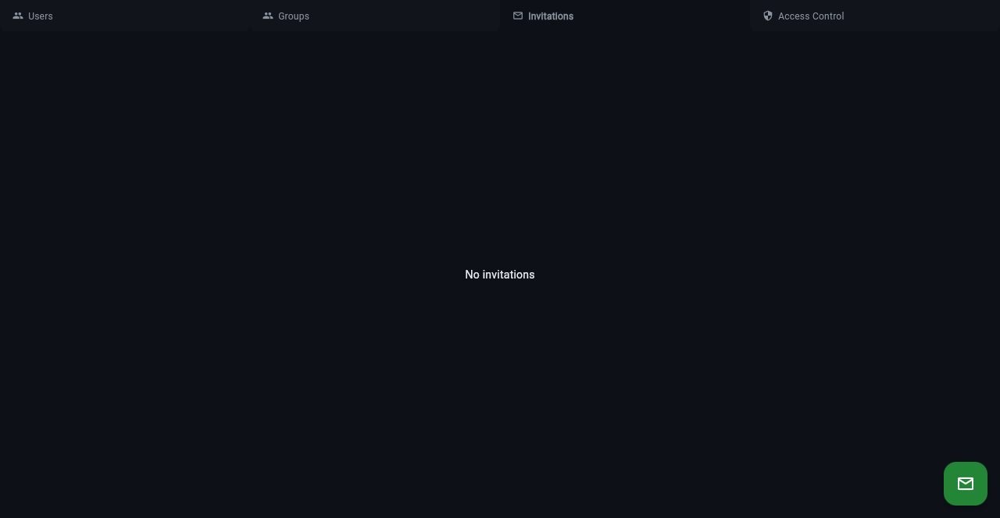
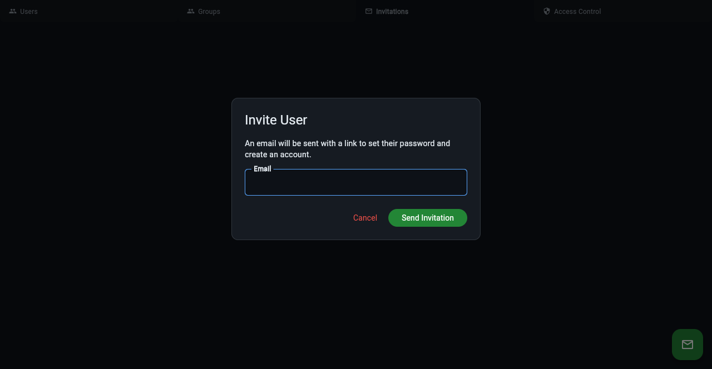

# Invitations

Admins can invite new users by email. The invited user receives a link
to create their account with a password — no self-registration required.



## Sending an Invitation

From the admin panel (**Admin > Invitations** tab), click the **+** button
and enter the email address. The system sends an invitation email with a
secure link that expires after 72 hours.



You can also invite users from the CLI:

```text
klangk invite user@example.com
```

## Invitation States

- **Pending** — invitation sent, waiting for user to accept
- **Accepted** — user clicked the link and created their account
- **Revoked** — admin cancelled the invitation before it was accepted

## Managing Invitations

The Invitations tab shows all invitations with their status, the admin
who sent them, and the date.

- **Resend** — click the pencil icon to resend the invitation email
- **Revoke** — click the trash icon to cancel a pending invitation

## Accepting an Invitation

The invited user clicks the link in the email, which opens a page where
they set their password. After accepting, they're automatically logged
in and can start using workspaces.

## Configuration

| Variable                     | Default | Description                            |
| ---------------------------- | ------- | -------------------------------------- |
| `KLANGK_DISABLE_INVITES`     | (unset) | Set to `1` to disable invitations      |
| `KLANGK_INVITE_EXPIRE_HOURS` | `72`    | How long invitation links remain valid |

## CLI Commands

```text
klangk invite <email>        # Send an invitation
klangk invitations           # List all invitations
```
