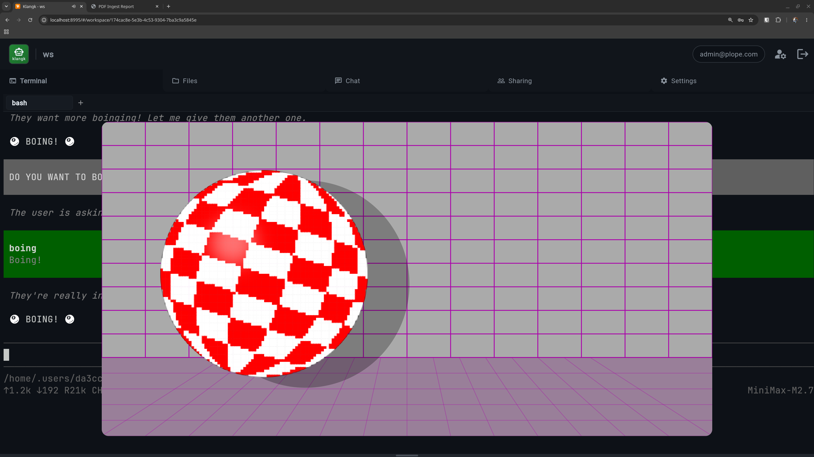

# Using Plugins

Plugins extend klangk workspaces with additional tools, UI widgets,
and container customizations. A plugin can install system packages
at image build time, add CLI tools to the container PATH, extend the
Pi agent with new tools, or add UI widgets to the web frontend.

For details on creating plugins, see the
[Creating Plugins](../development/creating-plugins.md) reference.

## Plugin management

[](../assets/update-plugins.png)

Plugins are fetched automatically when you run `devenv up`. On first
run, a `plugins.yaml` template with the default plugins is created
and plugins are fetched. On subsequent runs, plugins are only
re-fetched if `plugins.yaml` has changed. You can also run
`update-plugins` manually at any time. Plugins are declared in
`$KLANGK_PLUGINS_DIR/plugins.yaml`. Each entry requires `name` and
either `git` (for remote plugins) or `path` without `git` (for local
plugins).

### Git plugins

Remote plugins are cloned from a git repository. Both HTTPS and SSH URLs
work (`https://github.com/...` or `git@github.com:...`), but HTTPS is
the default since it doesn't require SSH keys. `path` and `ref` are
optional:

```yaml
plugins:
  - name: celebrate
    git: https://github.com/mcdonc/klangk.git
    path: plugins/celebrate
    ref: main
```

### Local plugins

Local plugins are symlinked from a directory on disk, which is useful
during plugin development — changes are reflected immediately without
re-fetching:

```yaml
plugins:
  - name: my-plugin
    path: /home/user/projects/my-plugin
```

Paths support `~` (home directory) and `$ENV_VAR` expansion. Relative
paths are resolved relative to the directory containing `plugins.yaml`.

- `update-plugins` — fetches all plugins listed in `plugins.yaml`,
  resolves git refs to commit SHAs, writes `plugins.lock`
- `update-plugins <name>` — fetch/update a single plugin by name
- `plugins.lock` — records resolved commit SHAs for reproducible
  builds
- If you are running devenv, it watches `$KLANGK_PLUGINS_DIR` to
  trigger rebuilds when plugin content or the lockfile changes

## Default plugins

[](../assets/boing-ball.png)

These plugins are included in the default `plugins.yaml`:

| Plugin           | What it does                                              |
| ---------------- | --------------------------------------------------------- |
| `claude-code`    | Installs Claude Code CLI agent at image build time        |
| `git-credential` | Git credential helper with browser-based PAT/OAuth dialog |
| `word-count`     | File stats tool for Pi (lines, words, characters, size)   |
| `pig-latin`      | Text-to-Pig-Latin converter for Pi                        |
| `celebrate`      | Triggers confetti animation in the browser via Pi         |
| `beep`           | Plays an audible beep via Web Audio API                   |
| `browser-fetch`  | HTTP fetch using browser session cookies via Pi           |
| `boingball`      | Bouncing Boing Ball animation overlay via Pi              |
