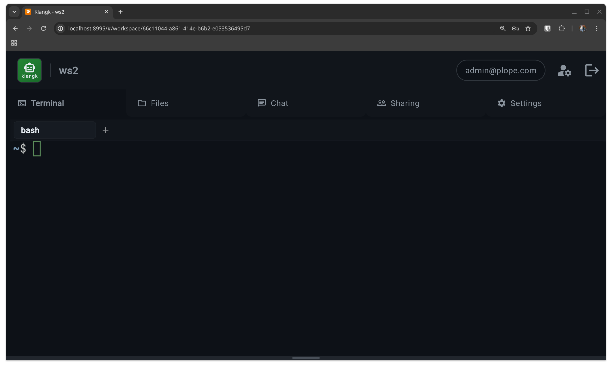
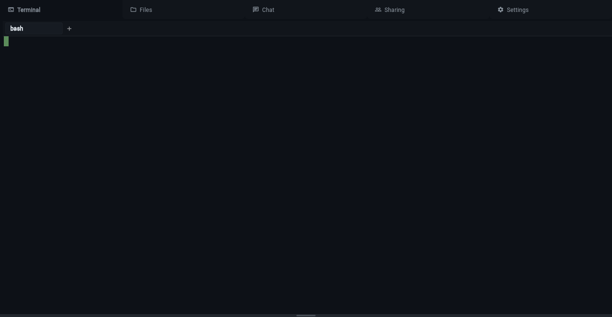
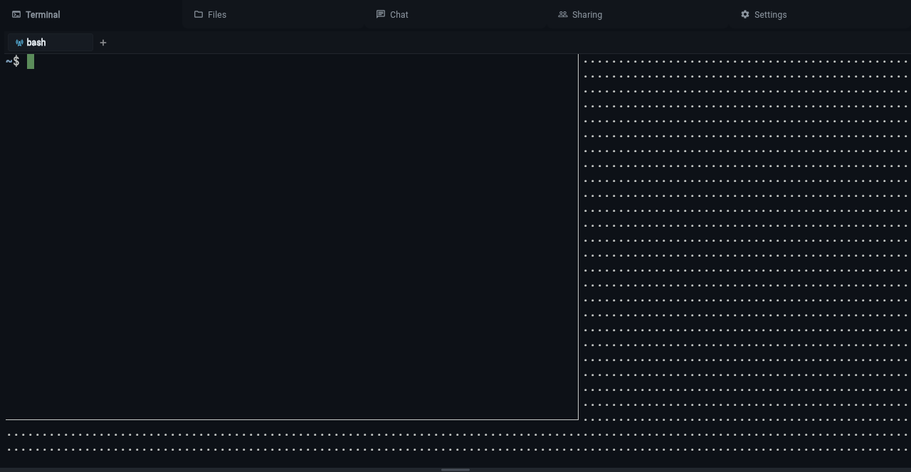
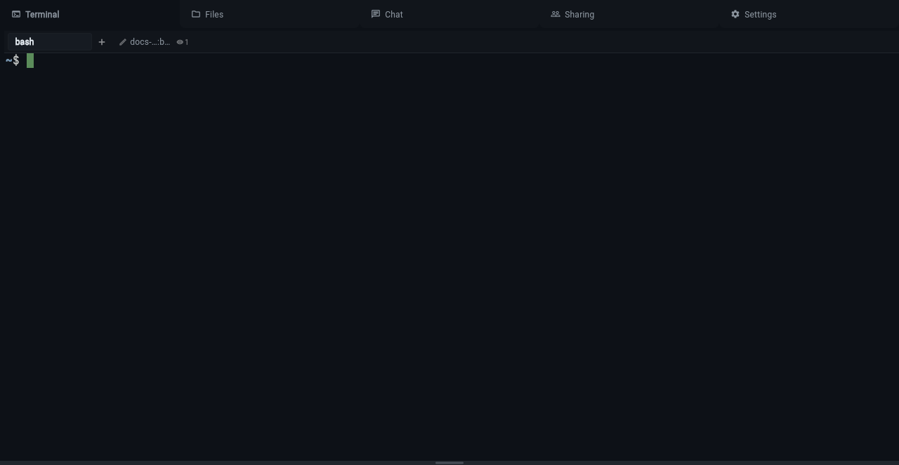
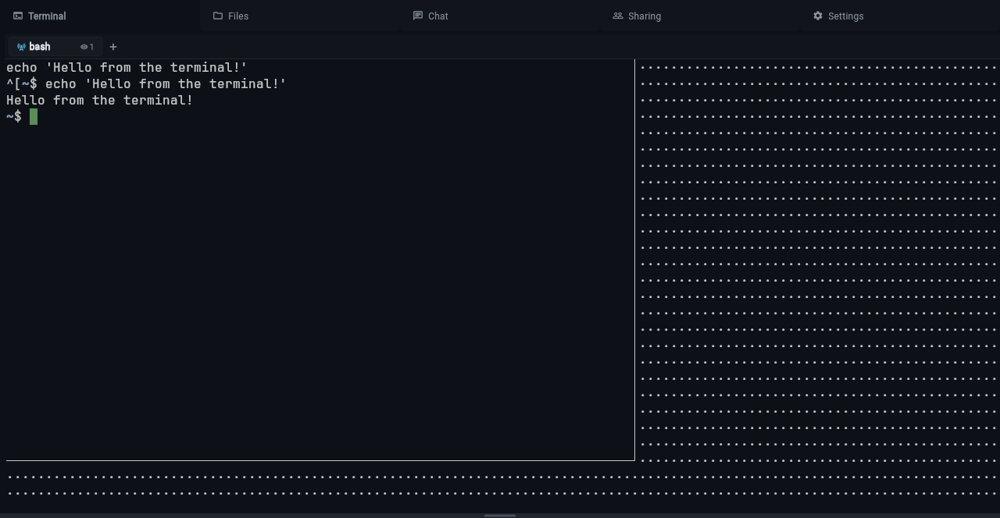

# Terminal

Klangk terminals give you shell access to a Linux container. Each
workspace runs its own isolated Linux environment — when you open a
terminal, you get a bash shell running on Linux regardless of
whether your local machine is Linux, macOS, or Windows.

Under the hood, every terminal runs inside
[tmux](https://github.com/tmux/tmux), a terminal multiplexer. You
never interact with tmux directly — Klangk's web UI and CLI manage
everything for you — but understanding the basics helps explain how
terminal features work.

## Why tmux?

Klangk uses tmux for three reasons:

1. **Session persistence** — your terminal survives disconnects and page
   refreshes. When you reconnect, you pick up exactly where you left off.
2. **Window management** — each terminal tab is a tmux window. Switching
   tabs is instant because all windows share the same tmux session.
3. **Shared terminals** — tmux session groups let multiple users see
   the same terminal in real time. One user's session group can have
   spectators or collaborators attached.

Tmux runs with no status bar, no prefix key, and no keybindings beyond
scrollback — it looks and feels like a plain terminal.

## How it maps to what you see

| Klangk concept            | tmux concept                                           |
| ------------------------- | ------------------------------------------------------ |
| Terminal tab              | tmux window                                            |
| Your set of tabs          | tmux session (named by your user ID)                   |
| Joining a shared terminal | New tmux session in the owner's session group          |
| Tab name                  | tmux window name (persists, visible to other users)    |
| Shell exit + respawn      | `remain-on-exit` + `pane-died` hook respawns the shell |

## Using the terminal

The terminal panel gives you direct shell access to the workspace
container. It starts on demand when you click the Terminal tab.

- Runs as the `klangk` user with bash (see [The Shell](the-shell.md)
  for zsh and customization)
- **Select to copy** — selecting text with the mouse automatically
  copies it to your system clipboard. This is a tmux feature: the
  selection is a tmux copy-mode selection (not a native browser
  selection), so it can span the full scrollback buffer, not just the
  visible viewport. To make a native browser selection instead (e.g.,
  for copying a URL), hold **Shift** while dragging.
- Right-click context menu with Paste (and Copy when text is selected)
- Mouse wheel scrollback via tmux copy mode
- If the container stops (idle timeout or crash), an overlay appears
  with a restart button. The terminal auto-reconnects after restart.

### Exiting a `klangkc shell` session

Typing `exit` or pressing **Ctrl+D** does **not** disconnect you from
the container. Klangk's tmux is configured with `remain-on-exit`, which
keeps the pane alive and immediately respawns a new shell. This is
intentional — it prevents you from accidentally losing your terminal
session.

To actually disconnect from a `klangkc shell` session, use the SSH-style
escape sequence: press **Enter**, then **~**, then **.** (period). This
cleanly disconnects the CLI client without affecting the tmux session
inside the container.

## Terminal tabs

Each user has their own set of terminal tabs. Tabs map 1:1 to tmux
windows inside the container. All tabs share a single tmux session
named by your user ID, so switching tabs is instant.

- Click **+** to create a new terminal tab (tmux window)
- Click a tab to switch to it
- Click **✕** on a tab to close it (only shown when more than one tab exists)
- Right-click a tab to open a context menu with **Rename** and **Share/Unshare**

### Renaming tabs

Right-click any tab and select **Rename** to change its display name. The
name is stored as the tmux window name, so it persists across reconnections
and is visible to other users if the tab is shared.

## Shared terminals

Any terminal tab can be promoted to a shared terminal, making it visible
and joinable by other workspace members. Sharing is per-tab — you can share
one tab while keeping others private.

Under the hood, when a user joins a shared terminal, Klangk creates a
new tmux session in the same **session group** as the owner's session.
Session groups share the same set of windows, so all participants see the
same content in real time. Each joiner gets an independent tmux session
(separate scroll position, active window selection) but shares the
underlying window panes.

### Sharing a tab

Right-click a tab and select **Share**. The tab gains a broadcast icon
indicating it is now shared. Other workspace members see the shared
tab appear in their tab bar.

To unshare, either:

- Right-click the tab and select **Unshare**, or
- Click the broadcast icon directly

### Joining a shared terminal

Shared terminals from other users appear in your tab bar with a prefix
showing the owner's handle (e.g., `alice:build`). Click the tab to join —
you are now seeing the same terminal session as the owner.

Depending on your role, you may be able to type (read-write) or only
watch (read-only). A lock icon indicates read-only access.

### Viewer tracking

When someone joins your shared terminal, an eye icon with a count appears
on the tab showing how many users are currently viewing.

Hover over the tab to see a tooltip listing the full tab name and the
handles of all current viewers.

## Role permissions

| Permission                     | Owners | Coders | Collaborators | Spectators |
| ------------------------------ | ------ | ------ | ------------- | ---------- |
| `terminal`                     | \*     | yes    | yes           | yes        |
| `code-in-isolation`            | \*     | yes    | yes           |            |
| `share-terminals`              | \*     |        |               |            |
| `code-in-shared-terminals`     | \*     |        | yes           |            |
| `spectate-on-shared-terminals` | \*     | yes    | yes           | yes        |
| `files`                        | \*     | yes    | yes           |            |
| `chat`                         | \*     | yes    | yes           | yes        |

\* Owners have the wildcard (`*`) permission which implies all permissions.

- **Owners** can share/unshare tabs, type in shared terminals, and rename tabs.
- **Coders** can watch shared terminals (read-only) but cannot share their own
  tabs or type in others' shared terminals. They have full isolated terminal
  and file access.
- **Collaborators** can type in shared terminals but cannot share their own tabs.
  They have full isolated terminal and file access.
- **Spectators** can watch shared terminals in read-only mode. They cannot start
  isolated terminals or access files.
