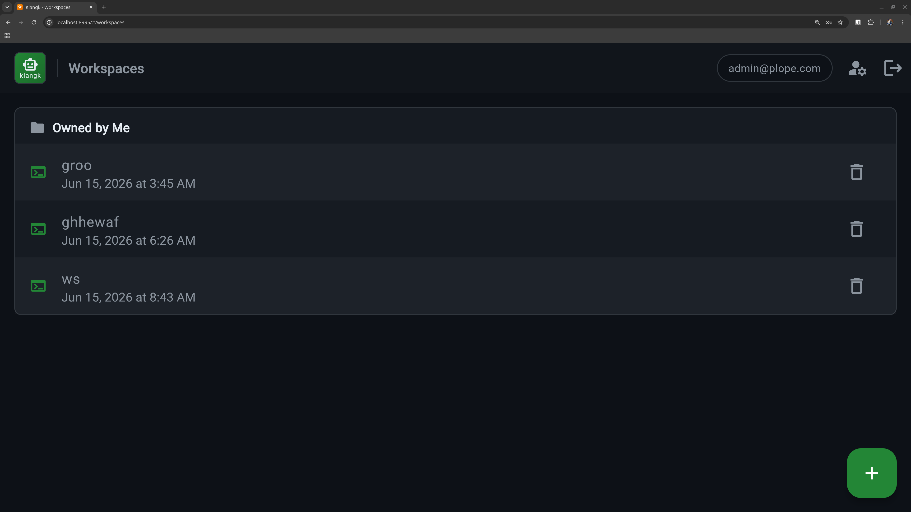

# Workspaces

A workspace is an isolated coding environment — its own container with
a terminal, file browser, and chat. Each user can create multiple
workspaces for different projects.

## Creating a workspace

Click the **+** button on the Workspaces page. Give it a name and
optionally configure:

- **Image** — the container image to use (defaults to
  `klangk-workspace`)
- **Default command** — a command to run when you open the terminal
  (e.g., `pi` to start the AI agent automatically). If unset, the
  terminal starts a tmux session with a login shell.
- **Bind mounts** — mount host directories into the container.
  If `KLANGK_ALLOWED_MOUNT_ROOTS` is set (comma-separated list of
  paths), only directories under those roots can be bind-mounted.
  Protected paths like the Docker/Podman socket are always blocked.
- **Environment variables** — set custom env vars for the container

You can change all of these later from the workspace Settings tab.

## What's inside a workspace

Each workspace runs in its own container with:

- A persistent home directory at `/home/<handle>/` (survives container
  restarts)
- A shared `work/` directory for project files
- Pre-installed tools and AI agents (see
  [Container Packages](container-packages.md) and
  [AI Coding Harnesses](ai-coding-harnesses.md))

Your dotfiles (`.bashrc`, `.gitconfig`, etc.), bash history, and Pi
sessions all persist across container restarts.

## Sharing workspaces

Workspace owners can share access with other users or groups from the
**Sharing** tab. Shared users connect to the same container and see
the workspace in a "Shared with Me" section on their workspace list.

Each shared user gets a role that controls what they can do — see
[Authorization](authorization.md#workspace-roles) for details.

Shared member avatars appear on workspace cards so you can see who
has access at a glance.

## Mount security

Workspace bind mounts are validated at create and edit time. Two
protections apply regardless of `KLANGK_ALLOWED_MOUNT_ROOTS`:

**Protected paths** — the following host paths are always blocked,
even if they fall under an allowed root:

- `/var/run/docker.sock`, `/run/docker.sock`,
  `/run/podman/podman.sock` — mounting a container engine socket
  grants full host control
- `KLANGK_DATA_DIR` (and anything beneath it) — contains every
  user's workspace home and the database

**Volume isolation** — named volumes (e.g., `nix-store:/nix`) are
labelled with `klangk.instance` and `klangk.user-id` at creation
time. A workspace cannot mount a volume created by a different
`KLANGK_INSTANCE_ID` or a different user. This prevents both
cross-tenant and cross-user data access on shared hosts.

## Idle timeout

Containers stop automatically after 30 minutes of inactivity
(configurable via `KLANGK_IDLE_TIMEOUT_SECONDS`). Activity includes
terminal input, file operations, and AI agent events — so containers
stay alive during long-running LLM requests as long as events are
flowing.

When a container stops, the terminal shows an overlay with a restart
button. Your files and home directory are preserved.

## Export and import

Workspaces can be exported as archives and imported to create new
ones. See [Export & Import](export-import.md).
