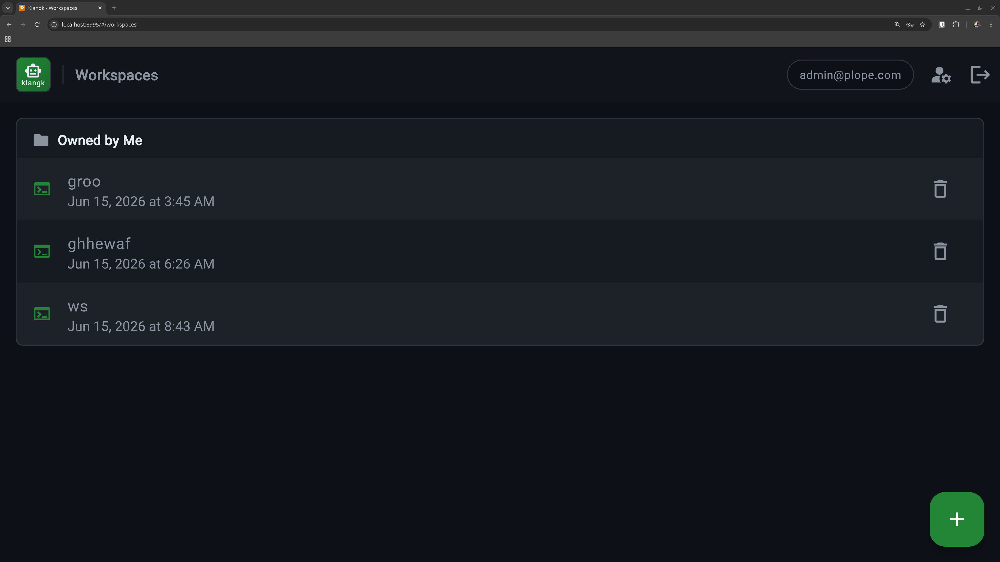

# Workspaces

[](../assets/workspaces.png)

A workspace is an isolated coding environment — its own container with
a terminal and file browser. Each user can create multiple
workspaces for different projects.

## Creating a workspace

Click the **+** button on the Workspaces page. Give it a name and
optionally configure:

- **Image** — the container image to use (defaults to
  `klangk-workspace`)
- **Service command** — a command to run when you open the terminal
  (e.g., `pi` to start the AI agent automatically). If unset, the
  terminal starts a tmux session with a login shell. See
  [Service Command](service-command.md).
- **Auto-start** — start the container automatically when the
  Klangk server starts. Useful for service workspaces that should
  be running before any user connects. If the workspace also has a
  service command, it will already be running when you connect.
- **Health check** — a shell command Klangk polls inside the
  container to verify the service is actually healthy (exit 0 =
  healthy). See [Health Check](health-check.md).
- **Bind mounts** — mount host directories into the container.
  If `KLANGKD_ALLOWED_MOUNT_ROOTS` is set (comma-separated list of
  paths), only directories under those roots can be bind-mounted.
  Protected paths like the Docker/Podman socket are always blocked.
- **Environment variables** — set custom env vars for the container
- **Allowed egress domains** — restrict outbound network access to a
  list of hosts (e.g., `github.com:443`, `pypi.org`). See
  [Egress Filtering](egress-filtering.md).
- **Per-handle home** — the home-directory layout. On: every member
  gets a private `/home/<handle>` (dotfiles, shell history, and agent
  configs are per-user). Off: everyone shares `/home/klangk`. The
  checkbox starts on the server default (`KLANGKD_PER_HANDLE_HOME`);
  if that default can't be fetched, the choice is left out and the
  server default applies. See [The Shell](the-shell.md).
- **Classification banner** — a free-text classification marking
  (e.g. `UNCLASSIFIED`, `CUI`, `SECRET`) shown as a persistent banner
  at the top and bottom of the workspace page and as a status line in
  the TUI. Empty = the server default
  (`KLANGKD_CLASSIFICATION_BANNER`); when neither is set, no banner is
  rendered and no screen space is reserved. Downloaded/exported files
  are not marked — the screen banner is the scope.

You can change all of these later from the workspace **Settings** tab.

## Home directory layout

Every workspace picks one of two home layouts:

- **Shared home** (the default) — all members share the single
  `/home/klangk`.
- **Per-handle home** — each member gets a private `/home/<handle>`
  directory; see [The Shell](the-shell.md).

The choice appears on the create form and the **Settings** tab (web),
the create and edit screens (TUI), and the CLI:

```bash
klangk create my-project --shared-home
klangk edit my-project --per-handle-home
```

The deploy-wide default for new workspaces is
`KLANGKD_PER_HANDLE_HOME`. Changing an existing workspace's layout
applies from the next connect/start — open terminals keep their
layout until they end.

## Auto-start

Workspaces with **auto-start** enabled start their containers
automatically when the Klangk server starts. This is useful for
service workspaces where a long-running process (configured via
[Service Command](service-command.md)) should be available
immediately — without waiting for a user to connect.

Auto-start requires the server to have `KLANGKD_ALLOW_AUTOSTART`
set to `1`/`true`/`yes`. When disabled (the default), the
auto-start option is hidden in the UI, CLI, and API.

Toggle auto-start from the workspace **Settings** tab, or via the
CLI:

```bash
klangk edit my-project --auto-start
klangk edit my-project --no-auto-start
```

When the server starts, it starts containers for all auto-start
workspaces. If the workspace has a service command, the command
is already running by the time any user connects.

## What's inside a workspace

Each workspace runs in its own container with:

- A persistent home directory (survives container restarts) — the
  shared `/home/klangk` under the default layout, or your private
  `/home/<handle>/` under per-handle (see
  [Home directory layout](#home-directory-layout) above)
- Pre-installed tools and AI agents (see
  [Container Packages](container-packages.md) and
  [AI Coding Harnesses](ai-coding-harnesses.md))

Project files live directly in the home directory — there is no
separate project subdirectory. Your dotfiles (`.bashrc`, `.gitconfig`,
etc.), bash history, and Pi sessions all persist across container
restarts.

## Sharing workspaces

Workspace owners can share access with other users or groups from the
**Sharing** tab, or from the CLI:

```bash
klangk share my-project user@example.com                # share (coder role)
klangk share my-project user@example.com --role=owner   # share with role
klangk unshare my-project user@example.com              # remove access
klangk members my-project                               # list members
```

Shared users connect to the same container and see the workspace in
a "Shared with Me" section on their workspace list.

Each shared user gets a role that controls what they can do — see
[Authorization](authorization.md#workspace-roles) for details.

Shared member avatars appear on workspace cards so you can see who
has access at a glance.

## Mount security

Workspace bind mounts are validated at create and edit time. Two
protections apply regardless of `KLANGKD_ALLOWED_MOUNT_ROOTS`:

**Protected paths** — the following host paths are always blocked,
even if they fall under an allowed root:

- `/var/run/docker.sock`, `/run/docker.sock`,
  `/run/podman/podman.sock` — mounting a container engine socket
  grants full host control
- `KLANGKD_DATA_DIR` (and anything beneath it) — contains every
  user's workspace home and the database

**Volume isolation** — named volumes (e.g., `nix-store:/nix`) are
labelled with `klangk.instance` and `klangk.user-id` at creation
time. A workspace cannot mount a volume created by a different
klangk instance or a different user. This prevents both
cross-tenant and cross-user data access on shared hosts. Operators
can cap how many volumes a user may create with
`KLANGKD_VOLUME_QUOTA_PER_USER` (default `0` = unlimited). The cap
is enforced at both creation paths — the volumes API and the
workspace-start auto-create of mounted named volumes (#2972): an
API create past the cap fails with a clear 429, a workspace start
past it fails with a clear start error.

## Idle timeout

Containers stop automatically after 60 minutes of inactivity
(configurable deploy-wide via `KLANGKD_IDLE_TIMEOUT_SECONDS`; the
default was raised from 30 to 60 minutes in #2480). Activity includes
terminal input, file operations, and AI agent events — so containers
stay alive during long-running LLM requests as long as events are
flowing.

When a container stops, the terminal shows an overlay with a restart
button. Your files and home directory are preserved.

The idle timeout is the only thing that automatically stops a container.
**Logging out does not** — your containers (and any service-command
processes, like an auto-started gateway) keep running after you log out,
so they're immediately available when you or a collaborator reconnect.
Only the idle timeout (or an explicit, admin-gated _Shutdown container_
command) tears a container down. This lets long-lived services outlive
any single user's session (#301, #1235).

### Per-workspace override

A workspace owner can override the deploy-wide default for a single
workspace (#1018) — for example to keep a long-running service alive
indefinitely, or to reap an expensive scratch workspace faster:

- **Web UI:** set **Idle Timeout (s)** in the workspace's Settings tab
  (or on the create-workspace dialog).
- **CLI:** pass `--idle-timeout` to `klangk create` or `klangk edit`.
- **API:** set `settings.idle_timeout` (a full-replace on `POST`/`PUT`,
  or a partial merge on `PATCH /api/v1/workspaces/{id}/settings`).

The value is seconds. `0` means **never idle out**; unset means the
deploy-wide `KLANGKD_IDLE_TIMEOUT_SECONDS` default. An override takes
effect the next time the container starts — a running container keeps
its current timeout until it is restarted. Auto-started workspaces are
pinned to `0` at boot so they come up unattended and stay up between
user connections.

## Export and import

Workspaces can be exported as archives and imported to create new
ones. See [Export & Import](export-import.md).
