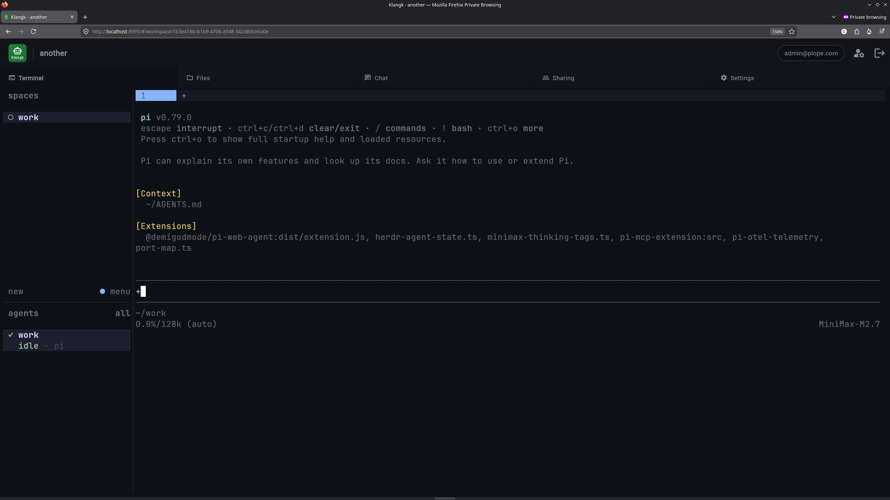

# Klangk: Multi-User AI Sandboxing, Collaboration and Coding Platform

## Why Klangk?

**For solo developers:** AI agents like Pi and Claude Code are powerful
but intentionally given wide permissions — they read, write, and
execute code on your behalf. Klangk keeps them safely isolated: each
workspace is its own container where an agent can work freely without
risking your host system or other projects.

**For teams:** Klangk adds multi-user collaboration on top of
sandboxing. Share workspaces with teammates, pair-program through
shared terminals, chat alongside your AI agent, and control access
with per-user roles and permissions within the same isolated
containers.

## Core Features

### Sandboxed Workspaces

Every workspace is a rootless Podman container with its own filesystem,
terminal sessions, and network ports. Mount your source code in,
run agents, and tear it down when you're done.

- Create from the web UI, the [CLI](reference/cli.md), or a
  [sandbox config](features/sandbox.md) file
- Bind-mount host directories or use named volumes for persistent data
- Run any container image — bring your own toolchains
- [Hosted apps](features/hosted-apps.md) map container ports to
  public URLs for web dev previews

### AI Agent Integration

Harnesses like Pi and Claude Code can run inside workspace containers
with full terminal access. The built-in chat agent ([clanker](features/chat.md)) can
answer questions, run commands, and edit files, confined to the workspace.

- Any OpenAI-compatible LLM provider (Ollama, cloud APIs, self-hosted)
- Agent responses stream into chat alongside human conversation
- [Pi extensions](features/ai-coding-harnesses.md) for browser
  automation, MCP tools, and more

### Multi-User Collaboration

Share workspaces with teammates. Everyone gets their own home directory
inside the container, and shared terminals let you pair-program in
real time.

- [Role-based access](features/authorization.md): owners, coders,
  collaborators, spectators
- [Shared terminals](features/terminal.md) with live input for
  pair programming
- [Chat](features/chat.md) with @mentions and message history
- [File viewer](features/file-viewer.md) with drag-and-drop upload,
  preview for code, markdown, images, PDFs, video, and spreadsheets

### Terminal

Terminals run inside [tmux](features/the-shell.md) for session
persistence and window management. Access them from the web UI or
connect from your local terminal with
[`klangk shell`](reference/cli.md).

### Administration

- [User and group management](features/admin-management.md)
- [Per-resource ACLs](features/authorization.md)
- [OIDC single sign-on](reference/oidc.md) (Google, GitHub, etc.)
- [Email invitations](features/invitations.md)

## Architecture

See the [architecture overview](architecture/index.md) for how the
backend, frontend, containers, and nginx fit together.
