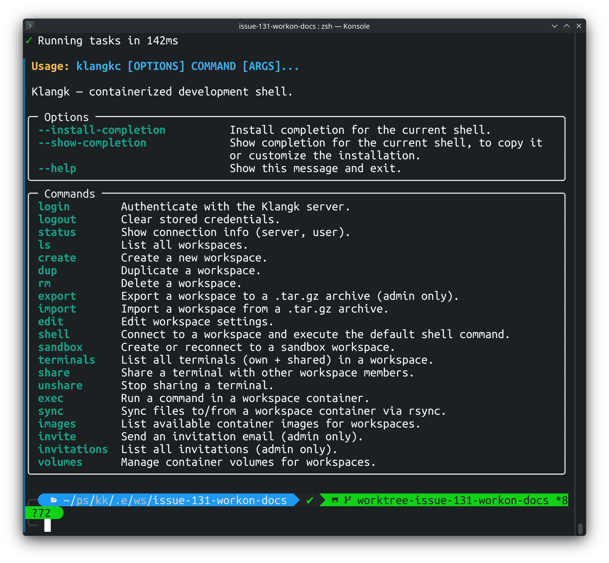

<!-- markdownlint-disable MD013 -->

# CLI

`klangkc` is the command-line client for Klangk. It lets you manage
workspaces, connect to container shells, sync files, and administer
users from your terminal without needing the web UI. It also
supports [sandboxing projects](../features/sandbox.md) from a config
file and [SSH agent forwarding](../features/ssh-agent-forwarding.md)
for using your local SSH keys inside containers.

[](../assets/cli-help.png)

## Installation

Install `klangkc` from PyPI:

```bash
pip install klangkc
```

Requires Python 3.12+.

## Configuration

`klangkc` uses two files in `~/.config/klangk/`:

- **`cli.yaml`** — user-edited settings. The CLI never writes to this
  file. Define server aliases, default users, and per-server overrides
  here.
- **`state.yaml`** — auto-managed by the CLI. Stores authentication
  tokens and tracks the active server and user. Do not edit this file
  manually.

### cli.yaml

```yaml
# Global defaults (apply to all servers unless overridden)
forward-agent: true
ws-max-size: 33554432 # 32 MB (default 16 MB)

# Named server aliases
servers:
  local:
    url: http://localhost:8995
    user: admin@example.com # default user for login
  prod:
    url: https://klangk.example.com
    user: chris@example.com
    forward-agent: false # override global default
```

All fields are optional. A minimal `cli.yaml` might just define one
server:

```yaml
servers:
  myserver:
    url: http://myhost:8995
```

You do not need to create `cli.yaml` manually. On your first
`klangkc login`, the CLI creates one automatically using the
hostname as the alias and the login user as the default:

```bash
klangkc login http://myhost:8995 admin@example.com
# Creates ~/.config/klangk/cli.yaml with:
#   servers:
#     myhost:
#       url: http://myhost:8995
#       user: admin@example.com
```

Subsequent logins do not modify `cli.yaml` — you can edit it
freely after the initial creation.

#### Settings

| Setting         | Scope            | Default  | Description                                        |
| --------------- | ---------------- | -------- | -------------------------------------------------- |
| `forward-agent` | global or server | `false`  | Forward local SSH agent into containers            |
| `ws-max-size`   | global or server | 16777216 | Maximum WebSocket message size in bytes            |
| `user`          | server only      |          | Default user (email or handle) for `klangkc login` |
| `url`           | server only      |          | Server URL (required for each server entry)        |

Per-server settings override global settings. CLI flags override both.

### state.yaml

Auto-managed. Stores the active server, active user per server, and
cached authentication tokens:

```yaml
active-server: http://localhost:8995
http://localhost:8995:
  active-user: admin@example.com
  users:
    admin@example.com:
      token: eyJ...
    other@example.com:
      token: eyJ...
```

Multiple users can be cached per server. `klangkc login` switches
the active user and reuses a cached token if it is still valid.

## Server selection

Commands need a server to talk to. The active server is determined by:

1. **`--server` flag** (highest priority) — pass on any command:
   `klangkc --server=prod ls`
2. **`active-server` in state.yaml** — set automatically by
   `klangkc login`
3. **Error** — if neither is available, the CLI exits with an error
   message

The `--server` flag accepts a server alias (defined in `cli.yaml`)
or a raw URL. It does not change `state.yaml`.

## Usage

```bash
# Authentication
klangkc login local                          # login to "local" alias (uses default user from config)
klangkc login http://localhost:8995          # login with a raw URL (prompts for user)
klangkc login prod chris@example.com         # login as a specific user
klangkc logout                               # logout from active server
klangkc logout prod                          # logout from a specific server
klangkc status                               # show active server and user

# Non-interactive login (for scripts)
klangkc login prod admin --password-file /path/to/pwfile
echo "secret" | klangkc login prod admin --password-file -

# Working with a non-default server
klangkc --server=prod ls                     # list workspaces on prod
klangkc --server=prod shell my-project       # connect to shell on prod

# Workspaces
klangkc ls                               # list workspaces (first page)
klangkc ls --shared                      # include workspaces shared with you
klangkc ls --limit 50                    # list up to 50 per section
klangkc ls --all                         # page through every workspace
klangkc ls --sort name --order asc       # sort by name, ascending
klangkc ls --filter gamma                # substring filter on name
klangkc create my-project                # create a workspace
klangkc create my-project --mount ~/src:/home/klangk/work/src          # with bind mount
klangkc create my-project --mount nix-store:/nix           # with named volume
klangkc create my-project --env FOO=bar                      # with env vars
klangkc edit my-project                  # interactive edit (name, image, command, mounts, env)
klangkc edit my-project --env FOO=bar    # set env var via flag
klangkc dup my-project my-copy           # duplicate a workspace
klangkc shell my-project                 # drop into bash inside the container
klangkc shell my-project debug           # attach to the "debug" terminal window (created if it doesn't exist)
klangkc sandbox myws                     # create workspace from .klangk-sandbox.yaml
klangkc sandbox myws ~/projects/myapp    # specify sandbox root explicitly
klangkc sandbox myws --force             # re-apply config and re-run setup on existing workspace
klangkc exec my-project ls /home/klangk/work         # run a command in the container
klangkc sync ~/src my-project:/home/klangk/work      # sync files to/from the container
klangkc rm my-project                # delete a workspace
klangkc restart my-project           # restart the container for a workspace (owner only)
klangkc export my-project            # export workspace to my-project.tar.gz (admin only)
klangkc export my-project -o bak.tar.gz  # export to specific file
klangkc import bak.tar.gz            # import workspace from archive
klangkc import bak.tar.gz --name new-name  # import with a different name

# Sharing
klangkc members my-project           # list workspace members by role
klangkc share my-project user@x.com  # share workspace (default: coder role)
klangkc share my-project user@x.com --role=spectator  # share with specific role
klangkc unshare my-project user@x.com # remove a user from all roles
klangkc terminal ls my-project       # list all terminals (own + shared)
klangkc terminal share my-project bash        # share a terminal with workspace members
klangkc terminal unshare my-project bash      # stop sharing a terminal

# Admin
klangkc invite user@example.com      # send an invitation email (admin only)
klangkc invitations                  # list all invitations (admin only)
klangkc images                       # list available container images
klangkc volumes ls                   # list your podman volumes
klangkc volumes create nix-store     # create a named volume (owned by you)
klangkc volumes rm nix-store         # delete a volume (must be yours)
```

The CLI connects to the running Klangk backend over HTTP + WebSocket — it works locally and against remote servers.

## Exiting the shell

To disconnect from `klangkc shell`, use the SSH-style escape sequence:
**Enter**, **~**, **.** (three keystrokes in sequence).

1. Press **Enter** to make sure you're at the beginning of a new line.
   The escape sequence is only recognized immediately after a newline.
2. Press **~** (tilde). Nothing visible happens yet — the CLI is
   waiting to see if the next character completes the escape.
3. Press **.** (period). The connection closes immediately and you're
   returned to your local shell.

If you type **~** and then any key other than **.**, the tilde and
that key are both sent to the remote shell as normal input. This
means **~** only has special meaning right after Enter — you can use
tildes freely in commands and text without triggering the escape.

> **Note:** Closing your terminal window or pressing **Ctrl+C** will
> also end the session, but the escape sequence is the clean way to
> disconnect without interrupting a running process inside the
> container.

## Named terminal windows

`klangkc shell` accepts an optional terminal name argument to connect to
a specific terminal window inside the workspace:

```bash
klangkc shell my-project build    # attach to the "build" window
klangkc shell my-project logs     # attach to the "logs" window
```

If the named window doesn't exist, it is created automatically. This
lets you open multiple named terminals from the CLI without using the web
UI. The new window also appears as a tab in the web UI for anyone
viewing the workspace.

Without a terminal name, `klangkc shell` connects to the currently
active window.

## Terminal behavior differences

`klangkc shell` provides the same tmux-based terminal as the web frontend, but clipboard behavior differs:

- **Web frontend**: Text selections auto-copy to the system clipboard via the browser bridge. Mouse wheel scrolls through scrollback. No extra setup needed.
- **CLI (`klangkc shell`)**: Text selections auto-copy to the system clipboard via [OSC 52](https://invisible-island.net/xterm/ctlseqs/ctlseqs.html#h3-Operating-System-Commands), which requires your terminal emulator to support it. Mouse wheel scrollback works. Native text selection (viewport-only) is available via **Shift+drag**.

### OSC 52 terminal support

The following terminal emulators support OSC 52 clipboard integration (auto-copy from tmux selections will work):

| Terminal         | OSC 52 support |
| ---------------- | -------------- |
| iTerm2           | Yes            |
| kitty            | Yes            |
| alacritty        | Yes            |
| WezTerm          | Yes            |
| foot             | Yes            |
| Windows Terminal | Yes            |
| Konsole          | Yes (22.04+)   |
| xterm            | Yes            |
| GNOME Terminal   | No             |
| Tilix            | No             |
| MATE Terminal    | No             |
| Terminator       | No             |

If your terminal does not support OSC 52, tmux selections will still be captured in the tmux paste buffer but will not automatically appear on your system clipboard. Consider switching to a terminal emulator that supports OSC 52 for the best `klangkc shell` experience.
