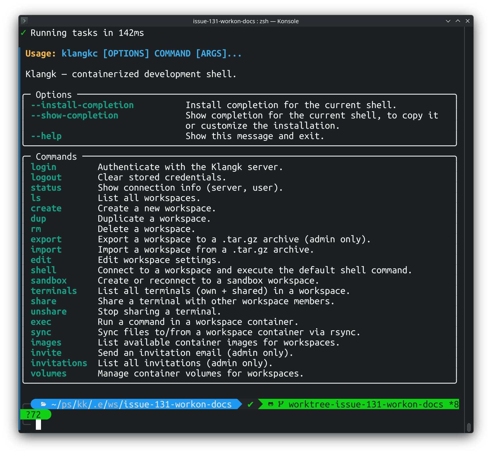

<!-- markdownlint-disable MD013 -->

# CLI

`klangk` is the command-line client for Klangk. It lets you manage
workspaces, connect to container shells, sync files, and administer
users from your terminal without needing the web UI. It also
supports [sandboxing projects](../features/sandbox.md) from a config
file and [SSH agent forwarding](../features/ssh-agent-forwarding.md)
for using your local SSH keys inside containers.

[](../assets/cli-help.png)

## Installation

Install `klangk` from PyPI:

```bash
pip install klangk
```

Requires Python 3.12+.

## Configuration

`klangk` uses two files, split across the XDG config and state trees:

- **`~/.config/klangk/klangk.yaml`** — user-edited settings (config tree).
  The CLI writes this file **once**, on first `klangk login`, then leaves it
  alone — after that it's yours to edit. Define server aliases, default users,
  and per-server overrides here.
- **`~/.local/state/klangk/klangk-state.yaml`** — auto-managed by the CLI
  (state tree). Stores authentication tokens and tracks the active server
  and user. Do not edit this file manually.

The split mirrors the distinction between intent (config — operator/user
edits) and disposable runtime artifacts (state — tokens the CLI can
regenerate via `klangk login`). The CLI's tree is `klangk`; the server's
(`klangkd`) tree is separate (`~/.config/klangkd/`, `~/.local/state/klangkd/`)
— different audiences, different shapes (#1646).

### klangk.yaml

```yaml
# Global defaults (apply to all servers unless overridden)
forward-agent: true
ws-max-size: 33554432 # 32 MB (default 16 MB)

# Named server aliases
servers:
  local:
    url: http://localhost:8997
    user: admin@example.com # default user for login
  prod:
    url: https://klangk.example.com
    user: chris@example.com
    forward-agent: false # override global default
```

All fields are optional. A minimal `klangk.yaml` might just define one
server:

```yaml
servers:
  myserver:
    url: http://myhost:8997
```

You do not need to create `klangk.yaml` manually. On your first
`klangk login`, the CLI creates one automatically using the
hostname as the alias and the login user as the default:

```bash
klangk login http://myhost:8997 admin@example.com
# Creates ~/.config/klangk/klangk.yaml with:
#   forward-agent: true   # on by default (set false to disable)
#   servers:
#     myhost:
#       url: http://myhost:8997
#       user: admin@example.com
```

Subsequent logins do not modify `klangk.yaml` — you can edit it
freely after the initial creation.

#### Settings

| Setting             | Scope            | Default  | Description                                       |
| ------------------- | ---------------- | -------- | ------------------------------------------------- |
| `forward-agent`     | global or server | `true`   | Forward local SSH agent into containers           |
| `ws-max-size`       | global or server | 16777216 | Maximum WebSocket message size in bytes           |
| `user`              | server only      |          | Default user (email or handle) for `klangk login` |
| `url`               | server only      |          | Server URL (required for each server entry)       |
| `terminal-open-cmd` | global           |          | Open TUI shell launches in a new terminal window  |

Per-server settings override global settings. CLI flags override both.

#### Opening shells in a new terminal (`terminal-open-cmd`)

By default, selecting a terminal in the TUI suspends the TUI and runs
`klangk shell` in the same terminal. With `terminal-open-cmd` set, each
selection instead spawns `klangk shell` in a **new terminal window** via
the configured command, and the TUI stays running (#2685).

The value is the command that opens a terminal; the `klangk shell`
invocation is appended as trailing arguments (most terminals take the
command to run after `-e` / `--`):

```yaml
# kitty
# terminal-open-cmd: kitty

# konsole — the window closes on its own when the shell disconnects
terminal-open-cmd: konsole -e

# wezterm
terminal-open-cmd: wezterm cli spawn --
```

Add `--hold` (konsole) or your terminal's equivalent **only** when you
want the window to remain open after the shell exits — e.g. to read
connect errors or final output. Without it the window closes itself,
which is usually what you want.

A list form is also accepted (no shell quoting to worry about):

```yaml
terminal-open-cmd:
  - alacritty
  - -T
  - klangk shell
  - -e
```

The environment variable `KLANGKC_TERMINAL_OPEN_CMD` overrides the file
value (same syntax as the string form):

```bash
export KLANGKC_TERMINAL_OPEN_CMD="konsole -e"
```

If the configured command cannot be executed (not installed, not
executable), the TUI shows an inline error and falls back to running the
shell in the current terminal. A command that starts but then fails on
its own (e.g. `wezterm cli spawn` with no wezterm GUI running) does not
trigger the fallback — prefer simple `terminal -e` style commands. Note
that in the string form the value is shell-split, so backslashes (as in
Windows paths) need the list form. When unset, behavior is unchanged
from before.

#### Exiting an external-terminal shell

Disconnect from the remote shell itself with the SSH-style escape —
press **Enter**, then **~**, then **.** (period). Typing `exit` or
**Ctrl+D** only ends the inner shell; klangk respawns it. After the
escape the CLI prints `Disconnected from <workspace>.` (a following
`[exited]` line is tmux confirming the outer session ended — not an
error). The terminal window then closes on its own. If you configured a
holding variant (e.g. `konsole --hold -e`) because you want the window
to remain open — say, to read final messages — close it with the
window's normal close button when you're done.

### klangk-state.yaml

Auto-managed. Stores the active server, active user per server, and
cached authentication tokens:

```yaml
active-server: http://localhost:8997
http://localhost:8997:
  active-user: admin@example.com
  users:
    admin@example.com:
      token: eyJ...
    other@example.com:
      token: eyJ...
```

Multiple users can be cached per server. `klangk login` switches
the active user and reuses a cached token if it is still valid.

### No-auth (single-user) servers

If the server runs with `KLANGKD_AUTH_MODES=none` (no-login local-dev mode),
login requires **no password** — `klangk login` calls `/api/v1/auth/local`
and stores the freely-issued token. See [Auth Modes](../features/auth-modes.md).

In `none` mode you don't even need to run `klangk login` for each command:
register the server once with `klangk login <server>`, and thereafter every
protected command auto-logs in (the `require_auth` gate probes the server mode
and calls `/auth/local`). Against a `password`/`oidc`/`both` server the normal
"Not logged in" error still fires.

## Server selection

Commands need a server to talk to. The active server is determined by:

1. **`--server` flag** (highest priority) — pass on any command:
   `klangk --server=prod ls`
2. **`active-server` in klangk-state.yaml** — set automatically by
   `klangk login`
3. **Error** — if neither is available, the CLI exits with an error
   message

The `--server` flag accepts a server alias (defined in `klangk.yaml`)
or a raw URL. It does not change `klangk-state.yaml`.

## Usage

```bash
# Authentication
klangk login local                          # login to "local" alias (uses default user from config)
klangk login http://localhost:8997          # login with a raw URL (prompts for user)
klangk login prod chris@example.com         # login as a specific user
klangk logout                               # logout from active server
klangk logout prod                          # logout from a specific server
klangk status                               # show active server and user

# Account self-service (change password / handle / email)
klangk account show                         # show your current handle and email
klangk account passwd                       # change your password (prompts for current + new)
klangk account handle                       # change your handle (prompts for new handle + password)
klangk account email                        # change your email (prompts for new email + password)

# Non-interactive login (for scripts)
klangk login prod admin --password-file /path/to/pwfile
echo "secret" | klangk login prod admin --password-file -

# Working with a non-default server
klangk --server=prod ls                     # list workspaces on prod
klangk --server=prod shell my-project       # connect to shell on prod

# Workspaces
klangk ls                               # list workspaces (first page)
klangk ls --shared                      # include workspaces shared with you
klangk ls --limit 50                    # list up to 50 per section
klangk ls --all                         # page through every workspace
klangk ls --sort name --order asc       # sort by name, ascending
klangk ls --filter gamma                # substring filter on name
klangk create my-project                # create a workspace
klangk create my-project --auto-start   # create with auto-start on server boot
klangk create my-project --mount ~/src:/home/klangk/src          # with bind mount
klangk create my-project --mount nix-store:/nix           # with named volume
klangk create my-project --env FOO=bar                      # with env vars
klangk create my-project --health-check 'curl -sf http://localhost:8080/health'  # with a service health check
klangk create my-project --command 'npm run dev'  # with a service command
klangk create my-project -c 'npm run dev'         # short form of --command
klangk create my-project --per-handle-home       # per-member private homes (default: shared /home/klangk)
klangk create my-project --allow github.com:443 --allow pypi.org  # with egress allowlist
klangk edit my-project                  # interactive edit (name, image, command, health check, mounts, env, allowed domains)
klangk edit my-project --auto-start     # enable auto-start on server boot
klangk edit my-project --no-auto-start  # disable auto-start
klangk edit my-project --env FOO=bar    # set env var via flag
klangk edit my-project --allow github.com:443     # set allowed egress domain via flag
klangk edit my-project --shared-home             # switch layout (applies from next connect/start)
klangk dup my-project my-copy           # duplicate a workspace
klangk shell my-project                 # drop into bash inside the container
klangk shell my-project debug           # attach to the "debug" terminal window (created if it doesn't exist)
klangk sandbox myws                     # create workspace from .klangk-sandbox.yaml
klangk sandbox myws ~/projects/myapp    # specify sandbox root explicitly
klangk sandbox myws --force             # re-apply config and re-run setup on existing workspace
klangk exec my-project ls /home/klangk           # run a command in the container (login shell: sources ~/.profile)
klangk exec --raw my-project rsync --server ...      # raw argv, no shell (for transports like rsync)
klangk monitor                                        # stream all server events as JSON
klangk monitor --type service_health | jq .           # pretty-print health transitions
klangk monitor --type service_health -- sh -c '[ "$KLANGK_HEALTHY" = false ] && notify-send "klangk" "$KLANGK_HEALTH_MESSAGE"'  # alert with the failure reason
klangk sync ~/src my-project:/home/klangk/src      # push files to the container — needs the exec-and-sync permission
klangk sync my-project:/home/klangk/src ~/src       # pull files out of the container — needs the exec-and-sync permission
klangk rm my-project                # delete a workspace
klangk stop my-project              # stop the container for a workspace
klangk start my-project             # start the container for a workspace
klangk restart my-project           # restart the container for a workspace (owner only)
klangk export my-project            # export workspace to my-project.tar.gz (owner/export permission)
klangk export my-project -o bak.tar.gz  # export to specific file
klangk import bak.tar.gz            # import workspace from archive
klangk import bak.tar.gz --name new-name  # import with a different name

# Sharing
klangk members my-project           # list workspace members by role
klangk share my-project user@x.com  # share workspace (default: coder role)
klangk share my-project user@x.com --role=spectator  # share with specific role
klangk unshare my-project user@x.com # remove a user from all roles
klangk terminal ls my-project       # list all terminals (own + shared)
klangk terminal share my-project bash        # share a terminal with workspace members
klangk terminal unshare my-project bash      # stop sharing a terminal

# Admin
klangk admin users ls                    # list all user accounts (admin only)
klangk admin users set-password user@example.com   # set/reset a password (admin only)
klangk admin invitations send user@example.com     # send an invitation email (admin only)
klangk admin invitations ls                       # list all invitations (admin only)
klangk images                       # list available container images
klangk volumes ls                   # list your podman volumes
klangk volumes create nix-store     # create a named volume (owned by you)
klangk volumes rm nix-store         # delete a volume (must be yours)
```

`klangk status` shows the active server, your user id/email, and whether
you hold site-wide admin privileges (derived from the server's
`/my-permissions` — the same source the web UI uses).

The `klangk account` group lets a logged-in user manage their own
credentials: `klangk account show` prints your current handle and email;
`passwd`, `handle`, and `email` prompt for the new value plus a password
confirmation (handle and email changes) or your current password (password
change). Validation matches the web UI: handles are lowercase
`[a-z0-9._-]+` (≤32 chars), emails must be well-formed, and the password
minimum is read from the server (`KLANGKD_MIN_PASSWORD_LENGTH`, surfaced at
`/api/v1/config`) rather than hardcoded. After an email change the CLI
re-keys your cached token under the new address — the token's subject is
your user id, so it stays valid. See
[Authentication § Account self-service](../features/authentication.md#account-self-service).

The CLI connects to the running Klangk backend over HTTP + WebSocket — it works locally and against remote servers.

## Exiting the shell

To disconnect from `klangk shell`, use the SSH-style escape sequence:
**Enter**, **~**, **.** (three keystrokes in sequence).

1. Press **Enter** to make sure you're at the beginning of a new line.
   The escape sequence is only recognized immediately after a newline.
2. Press **~** (tilde). Nothing visible happens yet — the CLI is
   waiting to see if the next character completes the escape.
3. Press **.** (period). The connection closes immediately and you're
   returned to your local shell.

If you type **~** and then any key other than **.**, the tilde and
that key are both sent to the remote shell as normal input. This
means **~** only has special meaning right after Enter — you can use
tildes freely in commands and text without triggering the escape.

> **Note:** Closing your terminal window or pressing **Ctrl+C** will
> also end the session, but the escape sequence is the clean way to
> disconnect without interrupting a running process inside the
> container.

## Named terminal windows

`klangk shell` accepts an optional terminal name argument to connect to
a specific terminal window inside the workspace:

```bash
klangk shell my-project build    # attach to the "build" window
klangk shell my-project logs     # attach to the "logs" window
```

If the named window doesn't exist, it is created automatically. This
lets you open multiple named terminals from the CLI without using the web
UI. The new window also appears as a tab in the web UI for anyone
viewing the workspace.

Without a terminal name, `klangk shell` connects to the currently
active window.

## Terminal behavior differences

`klangk shell` provides the same tmux-based terminal as the web frontend, but clipboard behavior differs:

- **Web frontend**: Text selections auto-copy to the system clipboard via the browser bridge. Mouse wheel scrolls through scrollback. No extra setup needed.
- **CLI (`klangk shell`)**: Text selections auto-copy to the system clipboard via [OSC 52](https://invisible-island.net/xterm/ctlseqs/ctlseqs.html#h3-Operating-System-Commands), which requires your terminal emulator to support it. The container's tmux emits the escape to the attached client and it is carried over the WebSocket to your terminal — including inside the consent-popup wrapper (the local wrapper tmux re-emits it) and in external terminals opened via `KLANGKC_TERMINAL_OPEN_CMD`. Mouse wheel scrollback works. Native text selection (viewport-only) is available via **Shift+drag**.

### OSC 52 terminal support

The following terminal emulators support OSC 52 clipboard integration (auto-copy from tmux selections will work):

| Terminal         | OSC 52 support |
| ---------------- | -------------- |
| iTerm2           | Yes            |
| kitty            | Yes            |
| alacritty        | Yes            |
| WezTerm          | Yes            |
| foot             | Yes            |
| Windows Terminal | Yes            |
| Konsole          | Yes (22.04+)   |
| xterm            | Yes            |
| GNOME Terminal   | No             |
| Tilix            | No             |
| MATE Terminal    | No             |
| Terminator       | No             |

If your terminal does not support OSC 52, tmux selections will still be captured in the tmux paste buffer but will not automatically appear on your system clipboard. Consider switching to a terminal emulator that supports OSC 52 for the best `klangk shell` experience.
